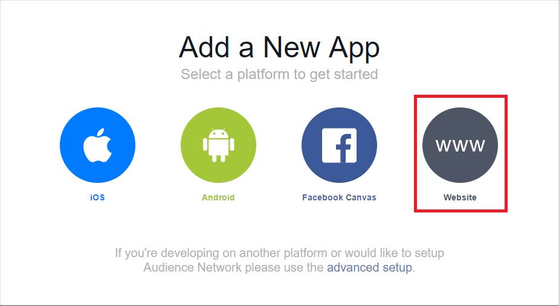
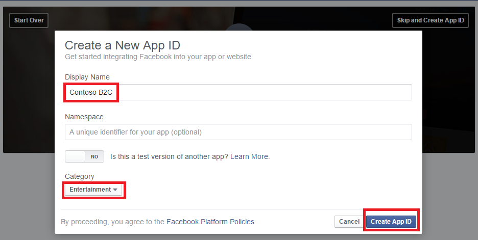
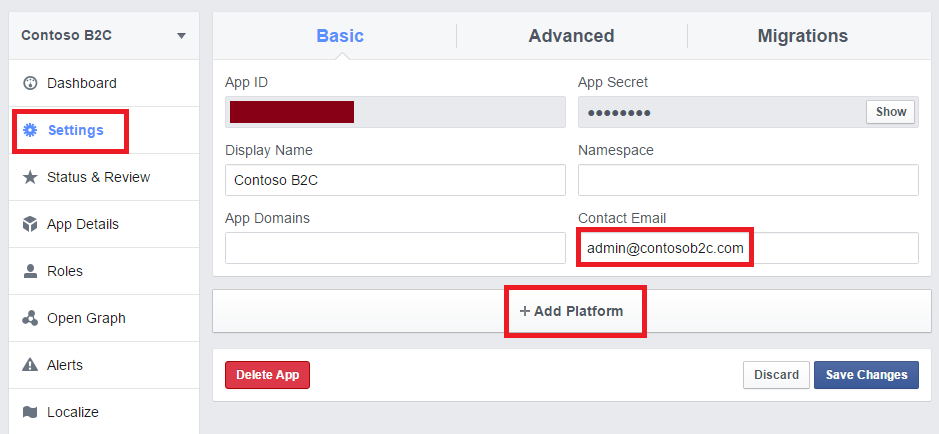
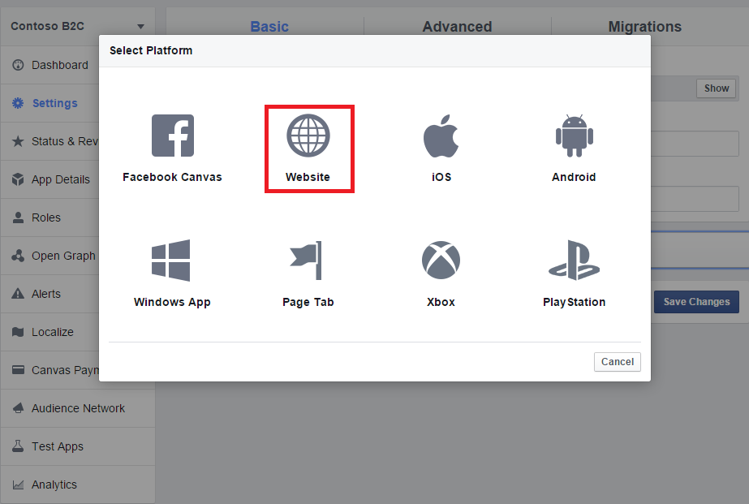
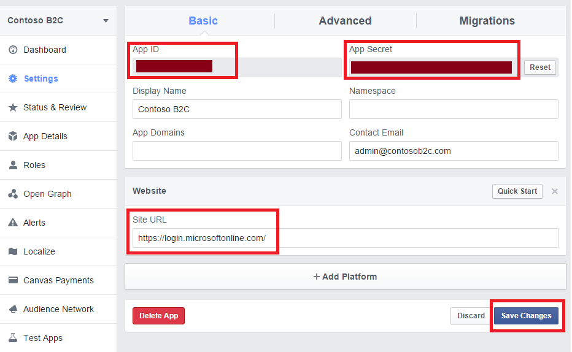
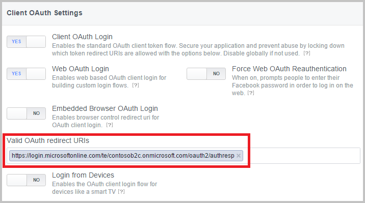
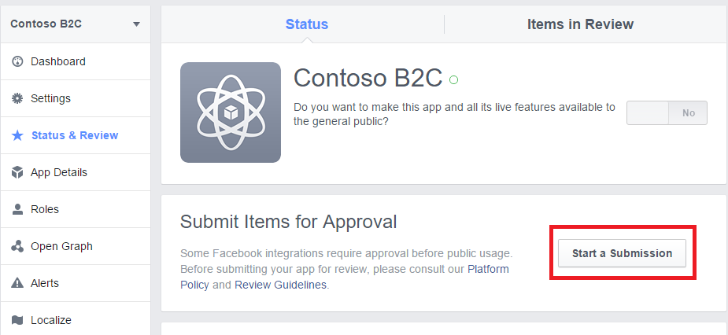

<properties
	pageTitle="Azure Active Directory B2C preview: Facebook configuration | Microsoft Azure"
	description="Provide sign up and sign in to consumers with Facebook accounts in your applications secured by Azure Active Directory B2C"
	services="active-directory-b2c"
	documentationCenter=""
	authors="swkrish"
	manager="msmbaldwin"
	editor="bryanla"/>

<tags
	ms.service="active-directory-b2c"
	ms.workload="identity"
	ms.tgt_pltfrm="na"
	ms.devlang="na"
	ms.topic="article"
	ms.date="01/12/2016"
	ms.author="swkrish"/>

# Azure Active Directory B2C preview: Provide Sign up and Sign in to Consumers with Facebook Accounts

[AZURE.INCLUDE [active-directory-b2c-preview-note](../../includes/active-directory-b2c-preview-note.md)]

## Create a Facebook Application

To use Facebook as an identity provider in Azure Active Directory (AD) B2C, you will first need to create a Facebook application and supply it with the right parameters. You will need a Facebook account to do this; if you don’t have one, you can get it at [https://www.facebook.com/](https://www.facebook.com/).

1. Go to the [Facebook Developers website](https://developers.facebook.com/) and sign in with your Facebook account credentials.
2. If you have not already done so, you need to register as a Facebook Developer. To do this, click **Register** (on the top right corner of the page), accept Facebook's policies and complete the registration steps.
3. Click **My Apps** and then **Add a new App**. Then choose **Website** as the platform, and then click **Skip and Create App ID**.

    

    

    

4. On the form, provide a **Display Name**, choose the appropriate **Category** and click **Create App ID**. Note: This requires you to accept Facebook Platform Policies and complete an online Security Check.

    

5. Click **Settings** on the left hand navigation. Enter a valid **Contact Email**.
6. Click on **+Add Platform** and then select **Website**.

    

    

7. Enter [https://login.microsoftonline.com/](https://login.microsoftonline.com/) in the **Site URL** field and then click **Save Changes**.
8. Copy the value of **App ID**. Click **Show** and copy the value of **App Secret**. You will need both of them to configure Facebook as an identity provider in your tenant. Note: **App Secret** is an important security credential.

    

9. Click the **Advanced** tab at the top, and then enter `https://login.microsoftonline.com/te/{tenant}/oauth2/authresp` in the **Valid OAuth redirect URIs** field (in the **Security** section), where **{tenant}** is to be replaced with your tenant's name (for example, contosob2c.onmicrosoft.com). Click **Save Changes** at the bottom of the page.

    

10. To make your Facebook application usable by Azure AD B2C, you need to make it publicly available. You can do this by clicking on **Status & Review** on the left navigation and submitting the application for review (click the **Start a Submission** button). Once your application has been approved by Facebook, you can make it public by turning the switch at the top of the page to **YES**. And clicking **Confirm**.

    

    

## Configure Facebook as an Identity Provider in your Tenant

1. [Follow these steps to navigate to the B2C features blade on the Azure Portal](active-directory-b2c-app-registration.md#navigate-to-the-b2c-features-blade).
2. On the B2C features blade, click **Identity providers**.
3. Click **+Add** at the top of the blade.
4. Provide a friendly **Name** for the identity provider configuration. For example, enter "FB".
5. Click **Identity provider type**, select **Facebook** and click **OK**.
6. Click **Set up this identity provider** and enter the **App ID** and **App secret** of the Facebook application that you created earlier in the **Client ID** and **Client secret** fields respectively.
7. Click **OK** and then **Create** to save your Facebook configuration.
