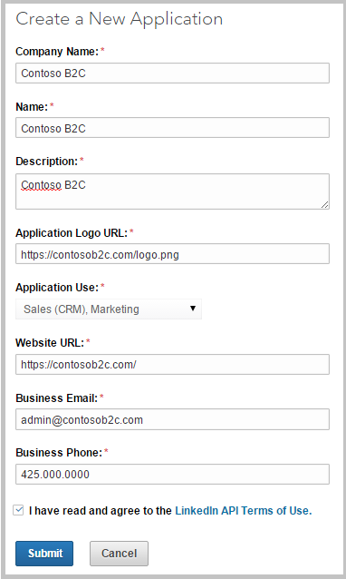

<properties
	pageTitle="Azure Active Directory B2C preview: LinkedIn configuration | Microsoft Azure"
	description="Provide sign up and sign in to consumers with LinkedIn accounts in your applications secured by Azure Active Directory B2C"
	services="active-directory-b2c"
	documentationCenter=""
	authors="swkrish"
	manager="msmbaldwin"
	editor="bryanla"/>

<tags
	ms.service="active-directory-b2c"
	ms.workload="identity"
	ms.tgt_pltfrm="na"
	ms.devlang="na"
	ms.topic="article"
	ms.date="01/12/2016"
	ms.author="swkrish"/>

# Azure Active Directory B2C preview: Provide Sign up and Sign in to Consumers with LinkedIn Accounts

[AZURE.INCLUDE [active-directory-b2c-preview-note](../../includes/active-directory-b2c-preview-note.md)]

## Create a LinkedIn Application

To use LinkedIn as an identity provider in Azure Active Directory (AD) B2C, you will first need to create a LinkedIn application and supply it with the right parameters. You will need a LinkedIn account to do this; if you don’t have one, you can get it at [https://www.linkedin.com/](https://www.linkedin.com/).

1. Go to the [LinkedIn Developers website](https://www.developer.linkedin.com/) and sign in with your LinkedIn account credentials.
2. Click **My Apps** in the top menu bar and then **Create Application**.

    

3. In the **Create a New Application** form, fill in the relevant information (**Company Name**, **Name**, **Description**, **Application Logo URL**, **Application Use**, **Website URL**, **Business Email** and **Business Phone**).
4. Agree to the LinkedIn API Terms of Use and click **Submit**.

    

5. Copy the values of **Client ID** and **Client Secret** (you can find them under the **Authentication Keys** section). You will need both of them to configure LinkedIn as an identity provider in your tenant. Note: **Client Secret** is an important security credential.

6. Enter `https://login.microsoftonline.com/te/{tenant}/oauth2/authresp` in the **Authorized Redirect URLs** field (under the **OAuth 2.0** section), where **{tenant}** is to be replaced with your tenant's name (for example, contoso.onmicrosoft.com) and click **Add**. Then click **Update**.

    

## Configure LinkedIn as an Identity Provider in your Tenant

1. [Follow these steps to navigate to the B2C features blade on the Azure Portal](active-directory-b2c-app-registration.md#navigate-to-the-b2c-features-blade).
2. On the B2C features blade, click **Identity providers**.
3. Click **+Add** at the top of the blade.
4. Provide a friendly **Name** for the identity provider configuration. For example, enter "LI".
5. Click **Identity provider type**, select **LinkedIn** and click **OK**.
6. Click **Set up this identity provider** and enter the **Client ID** and **Client secret** of the LinkedIn application that you created earlier.
7. Click **OK** and then **Create** to save your LinkedIn configuration.
