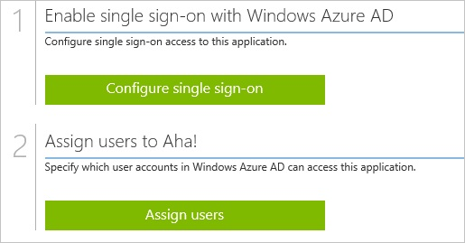
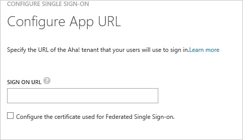
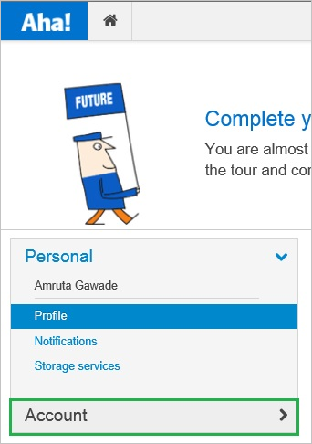
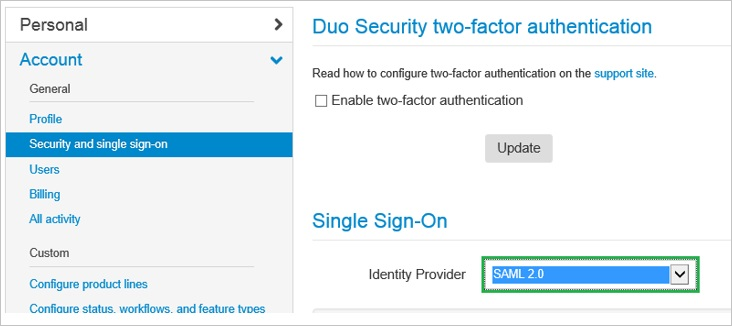
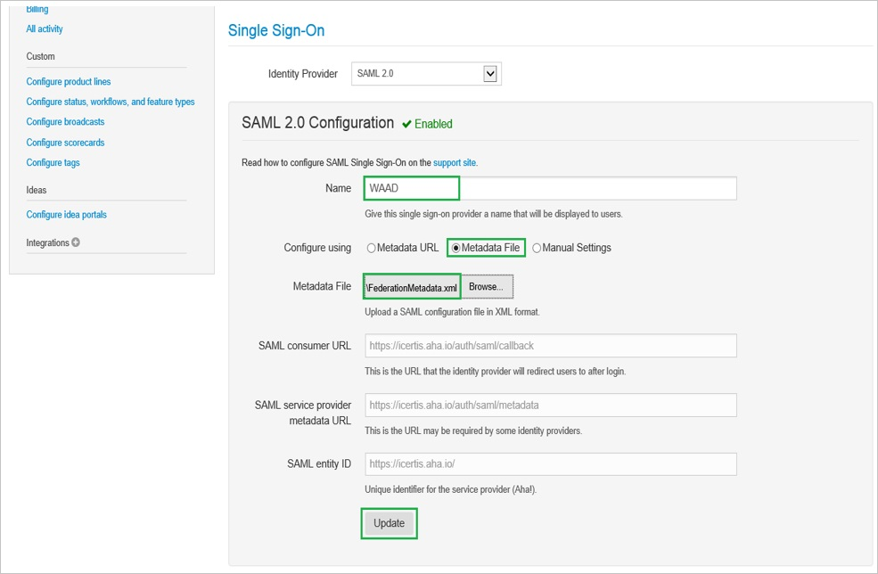

<properties 
    pageTitle="Tutorial: Azure Active Directory integration with Aha! | Microsoft Azure" 
    description="Learn how to use Aha! with Azure Active Directory to enable single sign-on, automated provisioning, and more!" 
    services="active-directory" 
    authors="jeevansd"  
    documentationCenter="na" 
    manager="stevenpo"/>
<tags 
    ms.service="active-directory" 
    ms.devlang="na" 
    ms.topic="article" 
    ms.tgt_pltfrm="na" 
    ms.workload="identity" 
    ms.date="01/14/2016" 
    ms.author="jeedes" />

#Tutorial: Azure Active Directory integration with Aha!

The objective of this tutorial is to show the integration of Azure and Aha!  
The scenario outlined in this tutorial assumes that you already have the following items:

-   A valid Azure subscription
-   An Aha! single sign-on enabled subscription

After completing this tutorial, the Azure AD users you have assigned to Aha! will be able to single sign into the application at your Aha! company site (service provider initiated sign on), or using the [Introduction to the Access Panel](active-directory-saas-access-panel-introduction.md).

The scenario outlined in this tutorial consists of the following building blocks:

1.  Enabling the application integration for Aha!
2.  Configuring single sign-on
3.  Configuring user provisioning
4.  Assigning users

##Enabling the application integration for Aha!

The objective of this section is to outline how to enable the application integration for Aha!.

###To enable the application integration for Aha!, perform the following steps:

1.  In the Azure Management Portal, on the left navigation pane, click **Active Directory**.

    

2.  From the **Directory** list, select the directory for which you want to enable directory integration.

3.  To open the applications view, in the directory view, click **Applications** in the top menu.

    

4.  Click **Add** at the bottom of the page.

    

5.  On the **What do you want to do** dialog, click **Add an application from the gallery**.

    

6.  In the **search box**, type **Aha!**.

    

7.  In the results pane, select **Aha!**, and then click **Complete** to add the application.

    
##Configuring single sign-on

The objective of this section is to outline how to enable users to authenticate to Aha! with their account in Azure AD using federation based on the SAML protocol.

###To configure single sign-on, perform the following steps:

1.  In the Azure AD portal, on the **Aha!** application integration page, click **Configure single sign-on** to open the **Configure Single Sign On ** dialog.

    

2.  On the **How would you like users to sign on to Aha!** page, select **Microsoft Azure AD Single Sign-On**, and then click **Next**.

    

3.  On the **Configure App URL** page, in the **Aha! Sign On URL** textbox, type the URL used by your users to sign-on to your Aha! Application (e.g.: "*https://company.aha.io/session/new*"), and then click **Next**.

    

4.  On the **Configure single sign-on at Aha!** page, to download your metadata file, click **Download metadata**, and then save the metadata file locally on your computer.

    

5.  In a different web browser window, log into your Aha! company site as an administrator.

6.  In the menu on the top, click **Settings**.

    

7.  Click **Account**.

    

8.  Click **Security and single sign-on**.

    

9.  In **Single Sign-On** section, as **Identity Provider**, select **SAML2.0**.

    

10. On the **Single Sign-On** configuration page, perform the following steps:

    

    1.  In the **Name** textbox, type a name for your configuration.
    2.  For **Configure using**, select **Metadata File**.
    3.  To upload your downloaded metadata file, click **Browse**.
    4.  Click **Update**.

11. On the Azure AD portal, select the single sign-on configuration confirmation, and then click **Complete** to close the **Configure Single Sign On** dialog.

    
##Configuring user provisioning

In order to enable Azure AD users to log into Aha!, they must be provisioned into Aha!.  
In the case of Aha!, provisioning is an automated task.  
There is no action item for you.
  
Users are automatically created if necessary during the first single sign-on attempt.

>[AZURE.NOTE] You can use any other Aha! user account creation tools or APIs provided by Aha! to provision AAD user accounts.

##Assigning users

To test your configuration, you need to grant the Azure AD users you want to allow using your application access to it by assigning them.

###To assign users to Aha!, perform the following steps:

1.  In the Azure AD portal, create a test account.

2.  On the **Aha! **application integration page, click **Assign users**.

    

3.  Select your test user, click **Assign**, and then click **Yes** to confirm your assignment.

    

If you want to test your single sign-on settings, open the Access Panel. For more details about the Access Panel, see [Introduction to the Access Panel](active-directory-saas-access-panel-introduction.md).
