<properties 
    pageTitle="Tutorial: Azure Active Directory integration with Salesforce Sandbox | Microsoft Azure" description="Learn how to use Salesforce Sandbox with Azure Active Directory to enable single sign-on, automated provisioning, and more!." 
    services="active-directory" 
    authors="jeevansd"  
    documentationCenter="na" 
    manager="stevenpo"/>

<tags 
    ms.service="active-directory" 
    ms.devlang="na" 
    ms.topic="article" 
    ms.tgt_pltfrm="na" 
    ms.workload="identity" 
    ms.date="12/18/2015" 
    ms.author="jeedes" />

#Tutorial: Azure Active Directory integration with Salesforce Sandbox
>[AZURE.TIP]For feedback, click [here](http://go.microsoft.com/fwlink/?LinkId=521878).
  
The objective of this tutorial is to show the integration of Azure and Salesforce Sandbox.  
Sandboxes give you the ability to create multiple copies of your organization in separate environments for a variety of purposes, such as development, testing, and training, without compromising the data and applications in your Salesforce production organization.  
For more details, see [Sandbox Overview](https://help.salesforce.com/HTViewHelpDoc?id=create_test_instance.htm&language=en_US)
  
The scenario outlined in this tutorial assumes that you already have the following items:

-   A valid Azure subscription
-   A sandbox in Salesforce.com
  
If you don’t have a valid sandbox in Salesforce.com yet, you need to contact Salesforce.
  
The scenario outlined in this tutorial consists of the following building blocks:

1.  Enabling the application integration for Salesforce Sandbox
2.  Configuring single sign-on
3.  Enabling your domain
4.  Configuring user provisioning
5.  Assigning users

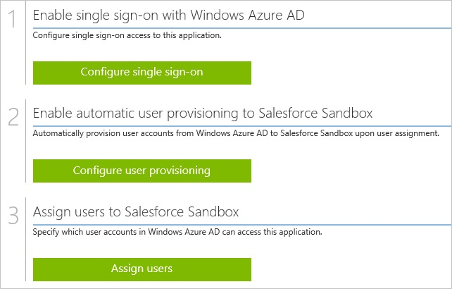
##Enabling the application integration for Salesforce Sandbox
  
The objective of this section is to outline how to enable the application integration for Salesforce sandbox.

###To enable the application integration for Salesforce sandbox, perform the following steps:

1.  In the Azure Management Portal, on the left navigation pane, click **Active Directory**.

    

2.  From the **Directory** list, select the directory for which you want to enable directory integration.

3.  To open the applications view, in the directory view, click **Applications** in the top menu.

    

4.  To open the **Application Gallery**, click **Add An App**, and then click **Add an application for my organization to use**.

    

5.  In the **search box**, type **Salesforce Sandbox**.

    

6.  In the results pane, select **Salesforce Sandbox**, and then click **Complete** to add the application.

    
##Configuring single sign-on
  
The objective of this section is to outline how to enable users to authenticate to Salesforce with their account in Azure AD using federation based on the SAML protocol.

###To configure single sign-on, perform the following steps:

1.  In the Azure AD portal, on the **Salesforce Sandbox** application integration page, click **Configure single sign-on** to open the **Configure Single Sign On** dialog.

    

2.  On the **How would you like users to sign on to Salesforce Sandbox** page, select **Microsoft Azure AD Single Sign-On**, and then click **Next**.

    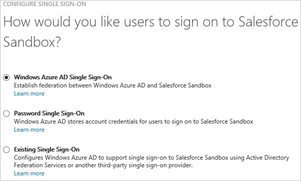

3.  On the **Configure App URL** page, in the **Sign On URL** textbox, type your URL using the following pattern `http://company.my.salesforce.com`, and then click **Next**.

    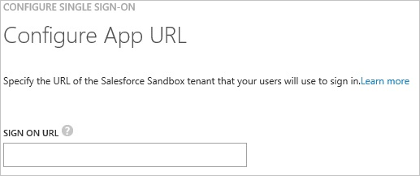

4. If you have already configured single sign-on for another Salesforce Sandbox instance in your directory, then you must also configure the **Identifier** to have the same value as the **Sign on URL**. The **Identifier** field can be found by checking the **Show advanced settings** checkbox on the **Configure App URL** page of the dialog.

4.  On the **Configure single sign-on at Salesforce Sandbox** page, click **Download certificate**, and then save the certificate file on your computer.

    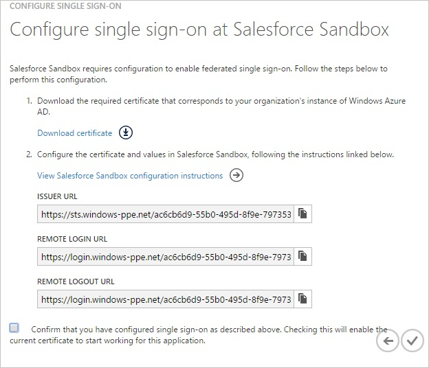

5.  In a different web browser window, log into your Salesforce sandbox as an administrator.

6.  In the menu on the top, click **Setup**.

    

7.  In the navigation pane on the left, click **Security Controls**, and then click **Single Sign-On Settings**.

    

8.  On the Single Sign-On Settings section, perform the following steps:

    

    1.  Select **SAML Enabled**.
    2.  Click **New**.

9.  On the SAML Single Sign-On Settings section, perform the following steps:

    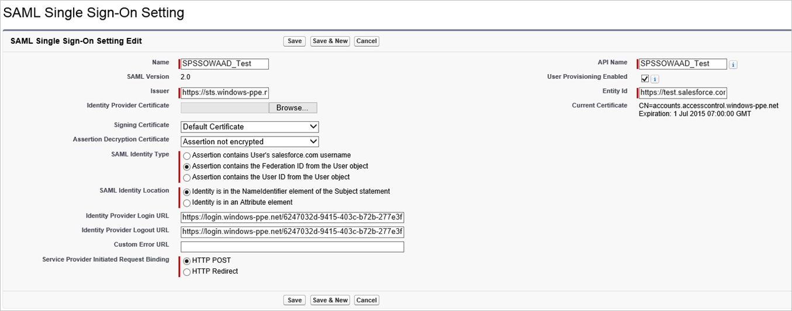

    1.  In the Name textbox, type the name of the configuration (e.g.: *SPSSOWAAD\_Test*).
    2.  In the Azure portal, on the **Configure single sign-on at Salesforce Sandbox** dialogue page, copy the **Issuer URL** value, and then paste it into the **Issuer** textbox.
    3.  In the **Entity Id** textbox, type **https://test.salesforce.com** if this is the first Salesforce Sandbox instance that you are adding to your directory. If you have already added an instance of Salesforce Sandbox, then for the **Entity ID** type in the **Sign On URL**, which should be in this format: `http://company.my.salesforce.com`
    4.  Click **Browse** to upload the downloaded certificate.
    5.  As **SAML Identity Type**, select **Assertion contains the Federation ID from the User object**.
    6.  As **SAML Identity Location**, select **Identity is in the NameIdentifier element of the Subject statement**.
    7.  In the Azure portal, on the **Configure single sign-on at Salesforce Sandbox** dialogue page, copy the **Remote Login URL** value, and then paste it into the **Identity Provider Login URL** textbox.
    8.  In the Azure portal, on the **Configure single sign-on at Salesforce Sandbox** dialogue page, copy the **Remote Logout URL** value, and then paste it into the **Identity Provider Logout URL** textbox.
    9.  As **Service Provider Initiated Request Binding**, select **HTTP POST**.
    10. Click **Save**.

10. On the Azure AD portal, select the single sign-on configuration confirmation, and then click **Complete** to close the **Configure Single Sign On** dialog.

    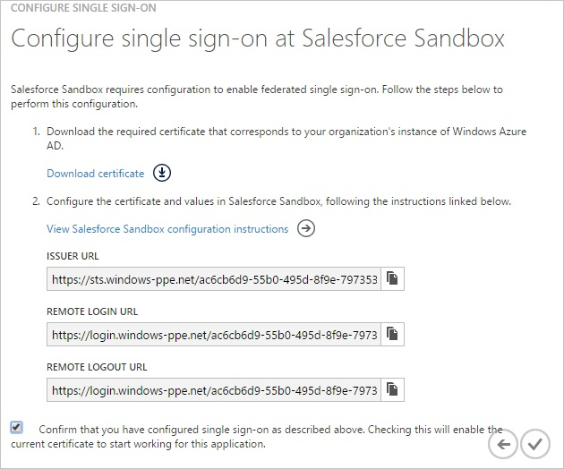

##Enabling your domain
  
This section assumes that you already have created a domain.  
For more details, see [Defining Your Domain Name](https://help.salesforce.com/HTViewHelpDoc?id=domain_name_define.htm&language=en_US).

###To enable your domain, perform the following steps:

1.  In the left navigation pane, click **Domain Management**, and then click **My Domain.**

    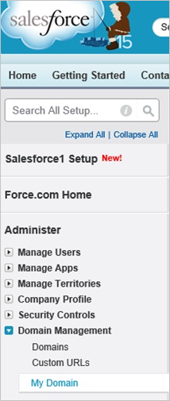

    >[AZURE.NOTE]Please make sure that your domain has been configured correctly.

2.  In the **Login Page Settings** section, click **Edit**, then, as **Authentication Service**, select the name of the SAML Single Sign-On Setting from the previous section, and finally click **Save**.

    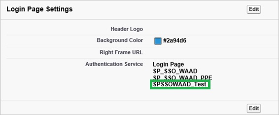
  
As soon as you have a domain configured, your users should use the domain URL to login to the Salesforce sandbox.  
To get the value of the URL, click the SSO profile you have created in the previous section.
##Configuring user provisioning
  
The objective of this section is to outline how to enable user provisioning of Active Directory user accounts to Salesforce Sandbox.

###To configure user provisioning, perform the following steps:

1.  In the Salesforce portal, in the top navigation bar, select your name to expand your user menu:

    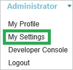

2.  From your user menu, select **My Settings** to open your **My Settings** page.

3.  In the left pane, click **Personal** to expand the Personal section, and then click **Reset My Security Token**:

    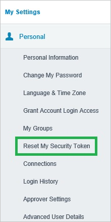

4.  On the **Reset My Security Token** page, click **Reset Security Token** to request an email that contains your Salesforce.com security token.

    

5.  Check your email inbox for an email from Salesforce.com with “**salesforce.com.com security confirmation**” as subject.

6.  Review this email and copy the security token value.

7.  In the Azure Management Portal, on the **salesforce Sandbox** application integration page, click **Configure user provisioning** to open the **Configure User Provisioning** dialog.

    

8.  On the **Enter your Salesforce Sandbox credentials to enable automatic user provisioning** page, provide the following configuration settings:

    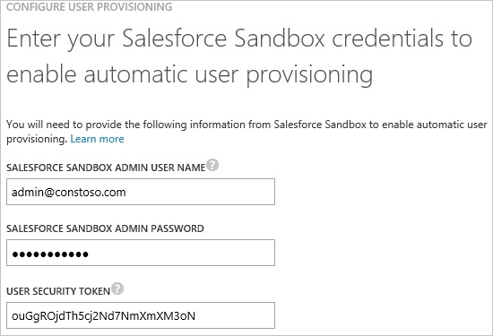

    1.  In the **Salesforce Sandbox Admin User Name** textbox, type a Salesforce sandbox account name that has the **System Administrator** profile in Salesforce.com assigned.

    2.  In the **Salesforce Sandbox Admin Password** textbox, type the password for this account.

    3.  In the **User Security Token** textbox, paste the security token value.

    4.  Click **Validate** to verify your configuration.

    5.  Click the **Next** button to open the **Confirmation** page.

9.  On the **Confirmation** page, click **Complete** to save your configuration.
##Assigning users
  
To test your configuration, you need to grant the Azure AD users you want to allow using your application access to it by assigning them.

###To assign users to Salesforce Sandbox, perform the following steps:

1.  In the Azure AD portal, create a test account.

2.  On the **Salesforce Sandbox **application integration page, click **Assign users**.

    

3.  Select your test user, click **Assign**, and then click **Yes** to confirm your assignment.

    
  
You should now wait for 10 minutes and verify that the account has been synchronized to Salesforce Sandbox.
  
If you want to test your single sign-on settings, open the Access Panel. For more details about the Access Panel, see [Introduction to the Access Panel](https://msdn.microsoft.com/library/dn308586).