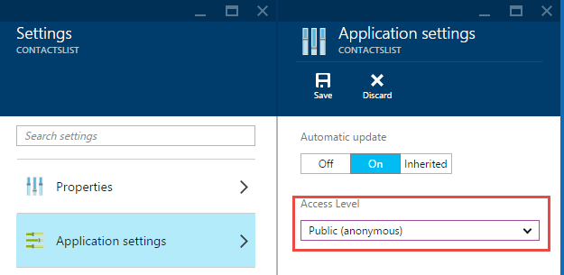
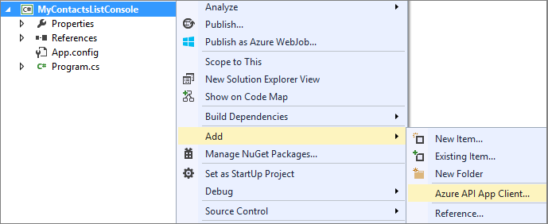
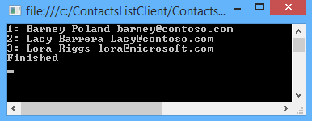
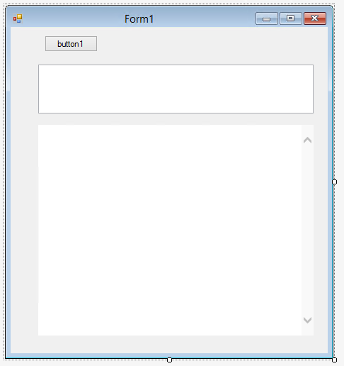
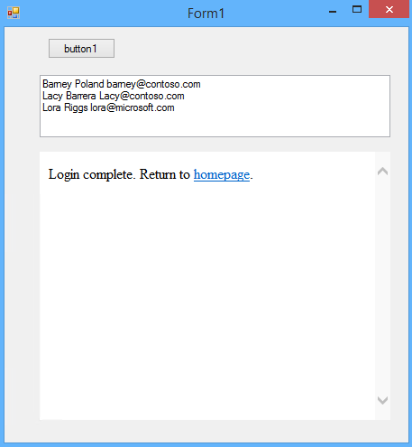

<properties 
	pageTitle="Consume an API app in Azure App Service from a .NET client" 
	description="Learn how to consume an API app from a .NET client using the App Service SDK." 
	services="app-service\api" 
	documentationCenter=".net" 
	authors="tdykstra" 
	manager="wpickett" 
	editor="jimbe"/>

<tags 
	ms.service="app-service-api" 
	ms.workload="web" 
	ms.tgt_pltfrm="dotnet" 
	ms.devlang="na" 
	ms.topic="article" 
	ms.date="02/19/2015" 
	ms.author="bradyg;tarcher"/>

# Consume an API app in Azure App Service from a .NET client 

## Overview

This tutorial shows how to use the App Service SDK to write code that calls an [API app](app-service-api-apps-why-best-platform.md) that has been configured for **Public (anonymous)** or **Public (authenticated)** access level. The article covers the following example scenarios:

- Call a **Public (anonymous)** API app from a console application
- Call a **Public (authenticated)** API app from a Windows Desktop application 

Each of these tutorial sections is independent -- you can follow the instructions for the second scenario without having completed the steps for the first one.

## Prerequisites

the tutorial assumes that you are familiar with how to create projects and add code to them in Visual Studio, and how to [manage API apps in the Azure preview portal](app-service-api-apps-manage-in-portal.md).

The project and code samples in this article are based on the API app project that you create, deploy, and protect in these articles:

- [Create an API app](app-service-dotnet-create-api-app.md)
- [Deploy an API app](app-service-dotnet-deploy-api-app.md)
- [Protect an API app](app-service-dotnet-add-authentication.md)

[AZURE.INCLUDE [install-sdk-2013-only](../includes/install-sdk-2013-only.md)]

This tutorial requires version 2.6 or later of the Azure SDK for .NET.

## Unauthenticated call from a console application

In this section you create a console application project and add code to it that calls an API app that doesn't require authentication. 

### Set up the API app and create the project

1. If you haven't already done so, follow the [Deploy an API app](app-service-dotnet-deploy-api-app.md) to deploy the ContactsList sample project to an API app in your Azure subscription.

	That tutorial directs you to set the access level in the Visual Studio publish dialog to **Available to anyone**, which is the same as **Public (anonymous)** in the portal. However, if you did the [Protect an API app](app-service-dotnet-add-authentication.md) tutorial after that, the access level has been set to **Public (authenticated)**, and in that case you need to change it as directed in the following step.

2. In the [Azure preview portal](https://portal.azure.com/), in the **API app** blade for the API app that you want to call, go to **Settings > Application Settings** and set **Access level** to **Public (anonymous)**.

	
 
2. In Visual Studio, create a console application project.
 
### Add App Service SDK generated client code

3. In **Solution Explorer**, right-click the project (not the solution) and select **Add > Azure API App Client**. 

	
	
3. In the **Add Azure API App Client** dialog, click **Download from Azure API App**. 

5. From the drop-down list, select the API app that you want to call. 

7. Click **OK**. 

	

	The wizard downloads the API metadata file and generates a typed interface for calling the API app.

	

	Once code generation is complete, you see a new folder in **Solution Explorer**, with the name of the API app. This folder contains the code that implements the client classes and data models. 

	

### Add code to call the API app

To call the API app, all you have to do is create a client object and call methods on it, as in this example:

        var client = new ContactList();
        var contacts = client.Contacts.Get();

1. Open *Program.cs*, and add the following code inside the `Main` method.

		var client = new ContactsList();
		
		// Send GET request.
		var contacts = client.Contacts.Get();
		foreach (var c in contacts)
		{
		    Console.WriteLine("{0}: {1} {2}",
		        c.Id, c.Name, c.EmailAddress);
		}
		
		// Send POST request.
		client.Contacts.Post(new Models.Contact
		{
		    EmailAddress = "lkahn@contoso.com",
		    Name = "Loretta Kahn",
		    Id = 4
		});
		Console.WriteLine("Finished");
		Console.ReadLine();

3. Press CTRL+F5 to run the application.

	

## Authenticated call from a Windows desktop application

In this section you create a Windows desktop application project and add code to it that calls an API app that requires authentication. This code implements the Oauth 2 *server authentication flow*, which means that the API app gateway, rather than the client application, procures the token from the authentication provider. 

Azure API apps also support the client authentication flow.  A client flow authentication scenario will be added to this tutorial in the future.

### Set up the API app and create the project

1. Follow the [Protect an API app](app-service-dotnet-add-authentication.md) tutorial to set up an API app with **Public (authenticated)** access level.

1. In Visual Studio, create a Windows Forms desktop project.

2. In the form designer, add the following controls:

	* A button control
	* A text box control
	* A web browser control

3. Set the text box control to multi-line.

	Your form should look like the following example.

	

### Add App Service SDK generated client code

3. In **Solution Explorer**, right-click the project (not the solution) and select **Add > Azure API App Client**. 

3. In the **Add Azure API App Client** dialog, click **Download from Azure API App**. 

5. From the drop-down list, select the API app that you want to call, and then click **OK**. 

### Add code to call the API app

5. In the Azure preview portal, copy the URL for your API app's gateway.  You'll use this value in the next step.

	

4. In *Form1.cs* source code, add the following code before the `Form1()` constructor, replacing the value for GATEWAY_URL with the value you copied in the previous step.  Make sure you include the trailing slash (/). 

		private const string GATEWAY_URL = "https://resourcegroupnameb4f3d966dfa43b6607f30.azurewebsites.net/";
		private const string URL_TOKEN = "#token=";

4. In the form designer, double-click the button to add a click handler, and then in the handler method add code to go to the login URL for the gateway, for example:

		webBrowser1.Navigate(string.Format(@"{0}login/[authprovider]", GATEWAY_URL));

	Replace "[authprovider]" with the code for the identity service provider that you configured in the gateway, for example, "aad", "twitter", "google", "microsoftaccount", or "facebook". For example:

		webBrowser1.Navigate(string.Format(@"{0}login/aad", GATEWAY_URL));

7. Add a `DocumentCompleted` event handler for the web browser control, and add the following code to the handler method.

		if (e.Url.AbsoluteUri.IndexOf(URL_TOKEN) > -1)
		{
		    var encodedJson = e.Url.AbsoluteUri.Substring(e.Url.AbsoluteUri.IndexOf(URL_TOKEN) + URL_TOKEN.Length);
		    var decodedJson = Uri.UnescapeDataString(encodedJson);
		    var result = JsonConvert.DeserializeObject<dynamic>(decodedJson);
		    string userId = result.user.userId;
		    string userToken = result.authenticationToken;
		
		    var appServiceClient = new AppServiceClient(GATEWAY_URL);
		    appServiceClient.SetCurrentUser(userId, userToken);
		
		    var contactsListClient = appServiceClient.CreateContactsList();
		    var contacts = contactsListClient.Contacts.Get();
		    foreach (Contact contact in contacts)
		    {
		        textBox1.Text += contact.Name + " " + contact.EmailAddress + System.Environment.NewLine;
		    }
		    //appServiceClient.Logout();
		    //webBrowser1.Navigate(string.Format(@"{0}login/aad", GW_URL));
		}

	The code you've added runs after the user logs in using the web browser control. After a successful login, the response URL contains the user ID and password. The code extracts these values from the URL, provides them to the App Service client object, and then uses that object to create an API app client object. You can then call the API by calling methods on this API app client object.

8. Press CTRL+F5 to run the application.

9. Click the button, and when the browser control displays a login page, enter the credentials of a user authorized to call the API app.

	Azure authenticates you, and the application calls the API app and displays the response.  

	

## Next steps

This article has shown how to consume an API app from a .NET client, for API apps set to **Public (authenticated)** and **Public (anonymous)** access levels. 

For additional examples of code that calls an API app from .NET clients, download the [Azure Cards](https://github.com/Azure-Samples/API-Apps-DotNet-AzureCards-Sample) sample application.
