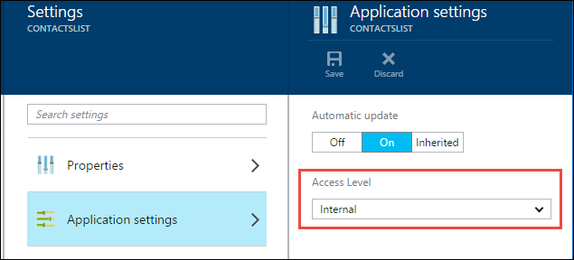
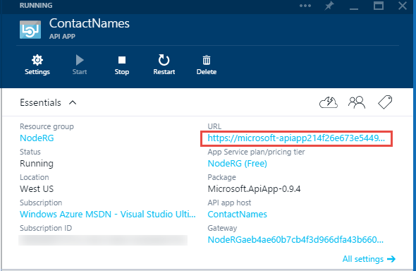
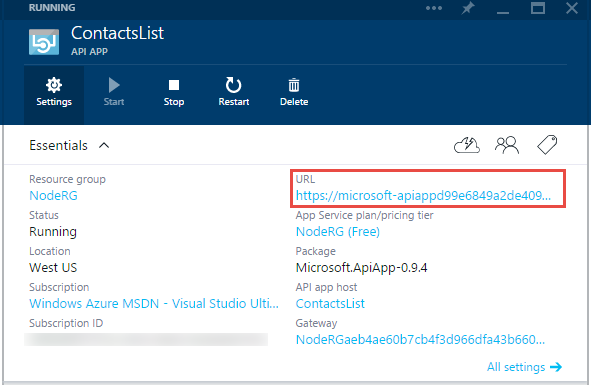

<properties 
	pageTitle="Consume an internal API app in Azure App Service from a .NET client" 
	description="Learn how to consume an API app from a .NET API app in the same resource group, using the App Service SDK." 
	services="app-service\api" 
	documentationCenter=".net" 
	authors="tdykstra" 
	manager="wpickett" 
	editor="jimbe"/>

<tags 
	ms.service="app-service-api" 
	ms.workload="web" 
	ms.tgt_pltfrm="dotnet" 
	ms.devlang="na" 
	ms.topic="article" 
	ms.date="01/08/2016" 
	ms.author="bradyg"/>

# Consume an internal API app in Azure App Service from a .NET client 

[AZURE.INCLUDE [app-service-api-v2-note](../../includes/app-service-api-v2-note.md)]

## Overview

This tutorial shows how to write code for an ASP.NET [API app](app-service-api-apps-why-best-platform.md) that calls another API app configured for **Internal** access level. Both API apps must be in the same resource group.  The same code can be used to call an internal API app from a [mobile app](../app-service-mobile/app-service-mobile-value-prop-preview.md).

You'll build a ContactNames Web API. The Web API's Get method will call a ContactsList API app and return just the names out of the contact information provided by the ContactsList API app. Here's the Swagger UI screen for a successful call to the ContactNames Get method.

For information about how to call API apps that are configured for **Public (anonymous)** or **Public (authenticated)** access levels, see [Consume an API app from a .NET client in Azure App Service](app-service-api-dotnet-consume.md).

## Prerequisites

The tutorial assumes that you are familiar with how to create projects and add code to them in Visual Studio, and how to [manage API apps in the Azure preview portal](../app-service-api-apps-manage-in-portal.md).

The project and code samples in this article are based on the API app project that you create and deploy in these articles:

- [Create an API app](app-service-dotnet-create-api-app.md)
- [Deploy an API app](app-service-dotnet-deploy-api-app.md)

[AZURE.INCLUDE [install-sdk-2013-only](../../includes/install-sdk-2013-only.md)]

This tutorial requires version 2.6 or later of the Azure SDK for .NET.

### Set up the target API app

1. If you haven't already done so, follow the [Deploy an API app](app-service-dotnet-deploy-api-app.md) tutorial to deploy the ContactsList sample project to an API app in your Azure subscription.

2. In the [Azure preview portal](https://portal.azure.com/), in the **API app** blade for the ContactsList API app that you deployed earlier, click **Settings > Application Settings** and set **Access level** to **Internal**, and then click **Save**.

	
 
## Create a new API app that will call the existing API app

- In Visual Studio, create an API app project named ContactNames by using the Azure API app project template.

	This is the same process that you followed in [Create an API app](app-service-dotnet-create-api-app.md), but you'll add different code to the project later in this tutorial.
 
## Add App Service SDK generated client code

The following steps are explained in more detail in [Consume an API app from a .NET client in Azure App Service](app-service-api-dotnet-consume.md). 

3. In **Solution Explorer**, right-click the project (not the solution) and select **Add > Azure API App Client**. 

3. In the **Add Azure API App Client** dialog, click **Download from Azure API App**. 

5. From the drop-down list, select the API app that you want to call. For this tutorial choose the ContactsList API app that you created earlier.

7. Click **OK**. 

## Enable Swagger UI

By default, API App projects are enabled with automatic [Swagger](http://swagger.io/ "Official Swagger information") metadata generation, but the Azure API App new-project template disables the API test page. In this section you enable the test page.

1. Open the *App_Start/SwaggerConfig.cs* file, and search for **EnableSwaggerUI**:

2. Uncomment the following lines of code:

	        })
	    .EnableSwaggerUi(c =>
	        {

## Create a controller

5. Right-click the **Controllers** folder, and select **Add > Controller**. 

6. In the **Add Scaffold** dialog, select the **Web API 2 Controller - Empty** option, and click **Add**. 

7. Name the controller **ContactNamesController**, and click **Add**. 

## Add code to call the API app

To call an API app that has been protected by setting its access level to **Internal**, you have to add 
internal authentication headers to HTTP requests. These headers inform the target API app that the source of the call is a peer API app calling from within the same resource group. 

The App Service SDK generates client classes that simplify the code you write to call API app. To call a **Public (anonymous)** API app all you have to do is create a client object and call methods on it, as in this example:

		var client = new ContactsList();
		var contacts = await client.Contacts.GetAsync();

However, to add authentication headers you need access to the `HttpRequestMessage` object and you don't have that here. To get access to the request and add the headers you have to create a `DelegatingHandler` class and pass in an instance of it to the constructor of the generated client.

1. Add to the project a class file named *InternalCredentialHandler.cs*, and replace the template code with the following code.

		using Microsoft.Azure.AppService.ApiApps.Service;
		using System.Net.Http;
		using System.Threading;
		using System.Threading.Tasks;
		
		namespace ContactNames
		{
		    public class InternalCredentialHandler : DelegatingHandler
		    {
		        protected override Task<HttpResponseMessage> SendAsync(HttpRequestMessage request, CancellationToken cancellationToken)
		        {
		            Runtime.FromAppSettings(request).SignHttpRequest(request);
		            return base.SendAsync(request, cancellationToken);
		        }
		    }
		}

	This code calls `SignHttpRequest` to add the authentication headers to every request sent by the generated client class:

		Runtime.FromAppSettings(this.Request).SignHttpRequest

1. In *ContactNamesController.cs*, replace the template code with the following code.

		using ContactNames.Models;
		using Microsoft.Azure.AppService.ApiApps.Service;
		using System;
		using System.Collections.Generic;
		using System.Net.Http;
		using System.Net.Http.Headers;
		using System.Threading.Tasks;
		using System.Web.Http;
		
		namespace ContactNames.Controllers
		{
		    public class ContactNamesController : ApiController
		    {
		        [HttpGet]
		        public async Task<IEnumerable<string>> Get()
		        {
		            var names = new List<string>();

		            var client = new ContactsList(new DelegatingHandler[] { new InternalCredentialHandler() });
		            var contacts = await client.Contacts.GetAsync();
		
		            foreach (Contact contact in contacts)
		            {
		                names.Add(contact.Name);
		            }		
		            return names;
		        }
		    }
		}

	This code passes in the handler to the constructor of the generated client class:

		var client = new ContactsList(new DelegatingHandler[] { new InternalCredentialHandler() });

### Deploy

You can't test by running locally.  You have to deploy the code and run it in an Azure API app; otherwise you won't be able to add the right authentication headers, and the calls will be rejected.

The following deployment steps are explained in more detail in [Deploy an API app](app-service-dotnet-deploy-api-app.md). 

1. Create a ContactNames API app.

	* In **Solution Explorer**, right-click the project (not the solution) and click **Publish**. 

	* Click the **Profile** tab, and then click **Microsoft Azure API Apps**. 

	* Click **New** to provision a new API App in your Azure subscription.

	* In the **Create an API App** dialog, enter ContactNames as the **API App Name**. 

	* For the other values in the **Create an API App** dialog, enter the same values that you entered earlier for the [Deploy an API app](app-service-dotnet-deploy-api-app.md). 

		Most importantly, make sure you create the new API app in the same resource group as the API app you're going to call.

	* Click **OK**. 

2. Deploy your code to the new API app.

	* Once the API app is provisioned, right-click the project in **Solution Explorer** and click **Publish** to re-open the publish dialog.

	* In the **Publish Web** dialog, click **Publish** to begin the deployment process. 

### Test

In this section you use the Swagger UI to test the new API app and verify that it can call the API app you created earlier.

1. Open a browser to the new API app's URL.

	With the default publish settings, when Visual Studio completes the publish process it automatically opens a browser to the URL of the API app.  If that doesn't happen, or you have closed that browser window, follow these steps to get to the same URL:

	* In the Azure preview portal, go to the API App blade for the new ContactsName API app.

	* Click **URL**. 

		
  
5. In the browser address bar, add `/swagger` to the end of the URL, and press Enter. 

	For example, the resulting URL will look like this:

		https://microsoft-apiapp214f26e673e5449a214f26e673e5449a.azurewebsites.net/swagger

1. In the Swagger UI page, click **ContactNames > Get > Try it out!**

	
  
	The page displays contact names in the Response Body section, which verifies that the ContactNames API app successfully retrieved data from the ContactsList API app. 

	If you want to verify that the **Internal** setting is protecting the ContactsList API app, comment out the `SignHttpRequest` call in *ContactNamesController.cs*, redeploy, run Swagger **Try it now** again, and you'll get an error message.

## Add code to call the API app by using HttpClient
 
The App Service SDK depends on Swagger API definitions to generate client classes. If you want to call an API app that has not implemented Swagger API definitions, you can do so using `HttpClient`. In this case, you still use the `SignHttpRequest` method, but you call it directly on the `HttpRequestMessage` object.

1. In *ContactNamesController.cs*, add the following code before the `return names;` statement in the `Get` method.

		var httpClient = new HttpClient();
		HttpRequestMessage httpRequest = new HttpRequestMessage();
		httpRequest.Method = HttpMethod.Get;
		httpRequest.RequestUri = new Uri("https://{yourapiappurl}/api/contacts");
		Runtime.FromAppSettings(this.Request).SignHttpRequest(httpRequest);
		var response = await httpClient.SendAsync(httpRequest); 
		var contacts2 = await response.Content.ReadAsAsync<List<Contact>>();
		foreach (Contact contact in contacts2)
		{
		    names.Add(contact.Name);
		}

	This code passes in the incoming request object to the `SignHttpRequest` method to sign the outgoing request object:

		Runtime.FromAppSettings(this.Request).SignHttpRequest(httpRequest);

2. In the Azure preview portal, go to the API app blade for the ContactsList API app, and copy the URL.

	
 
4. Replace the placeholder string "{yourapiappurl}" in the controller code with the actual URL. When you're done, that line of code will look like the following example.

		httpRequest.RequestUri = new Uri("https://microsoft-apiappd99e684d99e684d99e684d99e684.azurewebsites.net/api/contacts");

### Deploy and test

1. Follow the same procedure you did earlier to deploy the API app code.

	**Hint:** You can bypass the **Publish Web** dialog and redeploy by clicking a single button in the toolbar.  In Visual Studio, click **View > Toolbars**, and enable the **Web One Click Publish** toolbar.  
 
2. Follow the procedure you did earlier to use the Swagger UI.

	Since you left in the HttpClient code, the output this time shows a duplicate set of names.

	
  
## Next steps

This article has shown how to consume an internal API app from a .NET client. For information about how to consume API apps that are set to **Public (authenticated)** and **Public (anonymous)** access levels, see [Consume an API app from a .NET client in Azure App Service](app-service-api-dotnet-consume.md).  

For additional examples of code that calls an API app from .NET clients, download the [Azure Cards](https://github.com/Azure-Samples/API-Apps-DotNet-AzureCards-Sample) sample application.

For information about authentication in App Service, see [Authentication for API apps and mobile apps](../app-service/app-service-authentication-overview.md).
 
