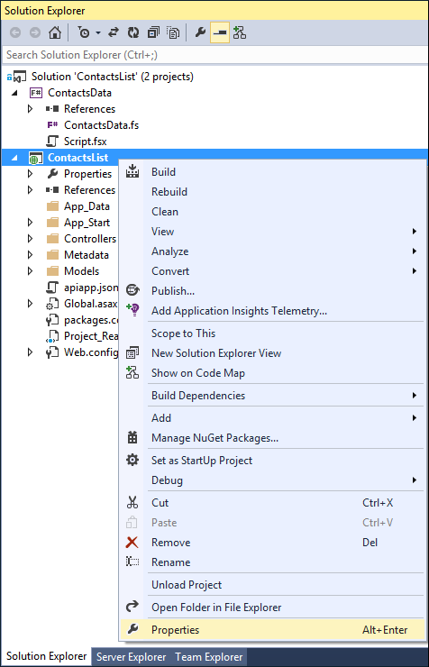
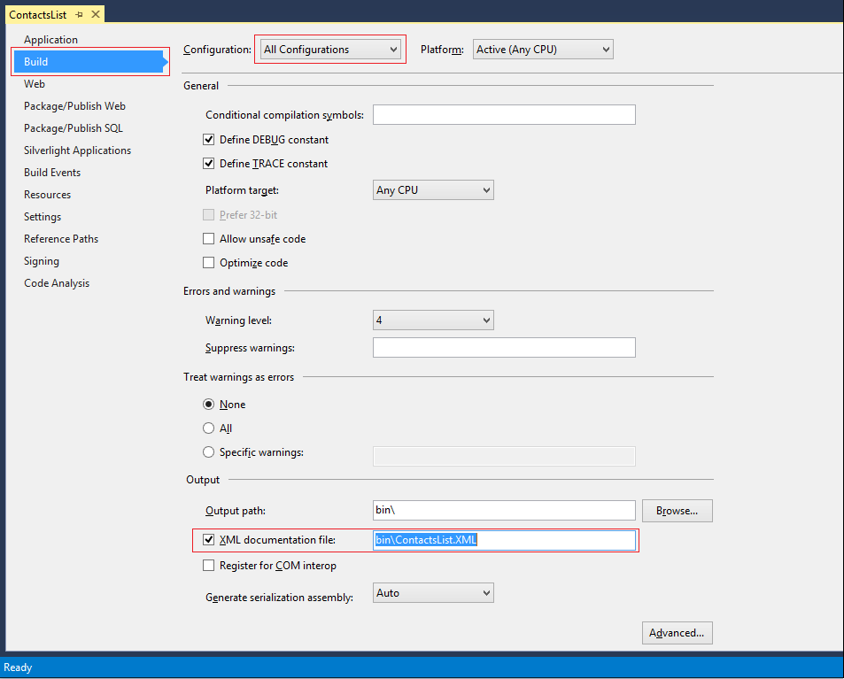

<properties
	pageTitle="Enhance your API App for Logic Apps | Microsoft Azure"
	description="How to decorate your API App to work nicely with Logic Apps"
	services="app-service\logic"
	documentationCenter=".net"
	authors="sameerch"
	manager="wpickett"
	editor="jimbe"/>

<tags
	ms.service="app-service-logic"
	ms.workload="na"
	ms.tgt_pltfrm="dotnet"
	ms.devlang="na"
	ms.topic="article"
	ms.date="01/08/2016" 
	ms.author="sameerch"/>

# Enhance your API App for Logic Apps #

In this article, you'll learn how to define the API definition of your API app so that it works well with Logic Apps. This will enhance the end user experience for your API app when it is used in the Logic Apps designer.

## Prerequisites

If you are new to [API apps](app-service-api-apps-why-best-platform.md) in [Azure App Service](../app-service/app-service-value-prop-what-is.md), we recommend reading the multi-part series on [creating API apps](app-service-dotnet-create-api-app.md)

## Add Display Names ##
The Logic Apps designer displays the names of operations, fields, and parameters, which may at times be cumbersome to read as they are programmatically generated. To improve readability, the Logic Apps designer can, where it is available, display a more readable text value - known as a *display name* - instead of the operation, field, and parameter default names. To accomplish this, the Logic Apps designer scans for the presence of certain properties in the swagger metadata provided by your API app.  The following properties are used as display names:

* Operations (Action and Triggers)  
  The value of the **summary** property if present; otherwise the value of **operationId** property. Note that the Swagger 2.0 specification allows for up to 120 characters for the **summary** property.

* Parameters (Inputs)  
  The value of the **x-ms-summary** extension property if present; otherwise the value of the **name** property. The **x-ms-summary** extension property must be set dynamically in code. That process is described in the "Using Custom Attributes to annotate extension properties" section of this topic. The **name** property can be set using /// comments. That process is described in the "Using XML Comments in API Definition generation" section of this topic.

* Schema Fields (Output Responses)  
  The value of the **x-ms-summary** extension property if present; otherwise the value of the **name** property. The **x-ms-summary** extension property must be set dynamically in code. That process is described in the "Using Custom Attributes to annotate extension properties" section of this topic. The **name** property can be set using /// comments. That process is described in the "Using XML Comments in API Definition generation" section of this topic.

**Note:** It is recommended to keep the length of your display names to 30 characters or less.

### Using XML Comments in API Definition generation

For development using Visual Studio, it is common practice to annotate your API controllers using [XML comments](https://msdn.microsoft.com/library/b2s063f7.aspx).  When compiled with [/doc](https://msdn.microsoft.com/library/3260k4x7.aspx), the compiler will create an XML documentation file.  The Swashbuckle toolset included with the API App SDK can incorporate those comments while generating the API metadata, and you can configure your API project to do that by following these steps:

1. Open your project in Visual Studio.

2. From the **Solution Explorer**, right-click the project and select **Properties**.

	

3. When the project's property pages appear, perform the following steps:

	- Select the **Configuration** for which the settings will apply. Typically, you will select All Configurations so that the settings you specify apply to both Debug and Release builds.
	
	- Select the **Build** tab on the left
	
	- Confirm that the **XML documentation file** option is checked. Visual Studio will supply a default file name based on your project's name. You can set its value to whatever your naming convention requires or leave it as-is.

	

4. Open the *SwaggerConfig.cs* file (located in the project's **App_Start** folder).

5. Add **using** directives to the top of the *SwaggerConfig.cs* file for the **System** and **System.Globalization** namespaces.

		using System;
		using System.Globalization;
 
6. Search the *SwaggerConfig.cs* file for a call to **GetXmlCommentsPath**, and uncomment the line so that it executes. Since you have not yet implemented this method, Visual Studio will underline the call to **GetXmlCommentsPath** and indicate that it's not defined in the current context. That's okay. You'll implement it in the next step.

7. Add the following implementation of the **GetXmlCommentsPath** method to the **SwaggerConfig** class (defined in the *SwaggerConfig.cs* file). This method will simply return the XML documentation file you specified earlier in the project's settings.

        public static string GetXmlCommentsPath()
        {
            return String.Format(CultureInfo.InvariantCulture, 
								 @"{0}\bin\ContactsList.xml", 
								 AppDomain.CurrentDomain.BaseDirectory);
        }

8. Finally, specify the XML comments for your controller methods. To do this, open one of your API app's controller files and type /// on an empty line preceding a controller method you want to document. Visual Studio will automatically insert a commented section within which you can specify a method summary as well as parameter and return value information. 

Now, when you build and publish your API app, you'll see that the documentation file is also in the payload and uploaded with the rest of your API app.

## Categorize Advanced Operations and Properties

The Logic Apps designer has limited screen real estate for showing operations, parameters, and properties. Additionally, an API App can define an extensive set of operations and properties. The result of so much information being displayed in a small area can result can make using the designer difficult for the end-user. 

To mitigate this clutter, the Logic Apps designer allows you to group the API app's operations and properties into user-defined categories. By using a proper categorization of the operations and properties, an API app can improve the user experience by presenting the most basic and useful operations and properties first.  

To provide this ability, the Logic Apps designer looks for the presence of a specific custom vendor extension property in the swagger API definition of your API App. This property is named **x-ms-visibility** and can take the following values:

* empty or "none"  
  These operations and properties are readily viewable by the user.

* "advanced"  
  As these operations and properties are advanced, they are hidden by default. However, the user can easily access them if needed.

* "internal"  
  These operations and properties are treated as system or internal properties and not meant to be directly used by the user.  As a result, they are hidden by the designer, and available only in the Code View.  For such properties, you may also specify the **x-ms-scheduler-recommendation** extension property to set the value through the Logic Apps designer.  For an example, refer the article on [adding triggers to an API App](app-service-api-dotnet-triggers.md).

## Using Custom Attributes to annotate extension properties

As mentioned above, custom vendor extension properties are used to annotate the API metadata to provide richer information that the Logic Apps designer can use.  If you use static metadata to describe your API app, you can directly edit the */metadata/apiDefinition.swagger.json* in your project to manually add the necessary extension properties.

For API apps that use dynamic metadata, you can make use of custom attributes to annotate your code.  You can then define an operation filter in the *SwaggerConfig.cs* file to look for the custom attributes and add the necessary vendor extension.  This approach is described in detail below for dynamically generating the **x-ms-summary** extension property.

1. Define an attribute class called **CustomSummaryAttribute** that will be used to annotate your code.

	    [AttributeUsage(AttributeTargets.All)]
	    public class CustomSummaryAttribute : Attribute
	    {
	        public string SummaryText { get; internal set; }

	        public CustomSummaryAttribute(string summaryText)
	        {
	            this.SummaryText = summaryText;
	        }
	    }

2. Define an operation filter called **AddCustomSummaryFilter** that will look for this custom attribute in the operation parameters.

	    using Swashbuckle.Swagger;

		...

		public class AddCustomSummaryFilter : IOperationFilter
	    {
	        public void Apply(Operation operation, SchemaRegistry schemaRegistry, System.Web.Http.Description.ApiDescription apiDescription)
	        {
	            if (operation.parameters == null)
	            {
	                // no parameter
	                return;
	            }

	            foreach (var param in operation.parameters)
	            {
	                var summaryAttributes = apiDescription.ParameterDescriptions.First(x => x.Name.Equals(param.name))
	                                        .ParameterDescriptor.GetCustomAttributes<CustomSummaryAttribute>();

	                if (summaryAttributes != null && summaryAttributes.Count > 0)
	                {
	                    // add x-ms-summary extension
	                    if (param.vendorExtensions == null)
	                    {
	                        param.vendorExtensions = new Dictionary<string, object>();
	                    }
	                    param.vendorExtensions.Add("x-ms-summary", summaryAttributes[0].SummaryText);
	                }
	            }
	        }
	    }

3. Edit the *SwaggerConfig.cs* file and add the filter class defined above.

            GlobalConfiguration.Configuration
                .EnableSwagger(c =>
                    {
                        ...
                        c.OperationFilter<AddCustomSummaryFilter>();
                        ...
                    }

4. Use the **CustomSummaryAttribute** class to annotate your code, as shown in the following code snippet.

        /// 

        /// Send Message
        /// 

        /// <param name="queueName">The name of the Storage Queue</param>
        /// <param name="messageText">The message text to be sent</param>
        public void SendMessage(
            [CustomSummary("Queue Name")] string queueName,
            [CustomSummary("Message Text")] string messageText)
        {
             ...
        }

	When you build the above API app, it would generate the following API metadata:

			...
            "post": {
                ...
                "parameters": [
                    {
                        "name": "queueName",
                        "in": "query",
                        "description": "The name of the Storage Queue",
                        "required": true,
                        "x-ms-summary": "Queue Name",
                        "type": "string"
                    },
                    {
                        "name": "messageText",
                        "in": "query",
                        "description": "The message text to be sent",
                        "required": true,
                        "x-ms-summary": "Message Text",
                        "type": "string"
                    }
                ],
                ...

5. Similarly, you can define schema filter **AddCustomSummarySchemaFilter** to automatically annotate the **x-ms-summary** extension property for your schema models, as in the following example.

	    public class AddCustomSummarySchemaFilter: ISchemaFilter
	    {
	        public void Apply(Schema schema, SchemaRegistry schemaRegistry, Type type)
	        {
	            SetCustomSummary(schema, type.GetCustomAttribute<CustomSummaryAttribute>());

	            if (schema.properties != null)
	            {
	                foreach (var property in schema.properties)
	                {
	                    var summaryAttribute = type.GetProperty(property.Key).GetCustomAttribute<CustomSummaryAttribute>();
	                    SetCustomSummary(property.Value, summaryAttribute);
	                }
	            }
	        }

	        private static void SetCustomSummary(Schema schema, CustomSummaryAttribute summaryAttribute)
	        {
	            if (summaryAttribute != null)
	            {
	                if (schema.vendorExtensions == null)
	                {
	                    schema.vendorExtensions = new Dictionary<string, object>();
	                }
	                schema.vendorExtensions.Add("x-ms-summary", summaryAttribute.SummaryText);
	            }
	        }
	    }

## Summary

In this article, you have seen how to enhance the user experience of your API app when it is used in the Logic Apps designer.  As a best practice, it is recommended that you provide proper friendly names for all operations (actions and triggers), parameters and properties.  It is also recommended that you provide no more than 5 basic operations.  For input parameters, the recommendation is to restrict the number of basic properties to no more than 4, and for properties, the recommendation is 5 or less. The remainder of your operations and properties should be marked as advanced.
 
