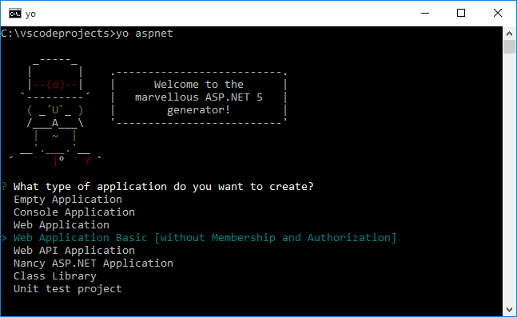
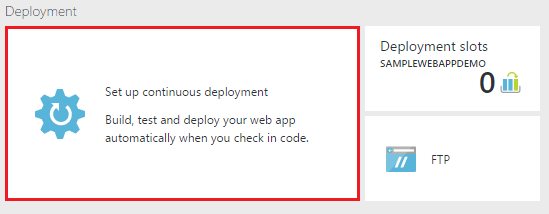
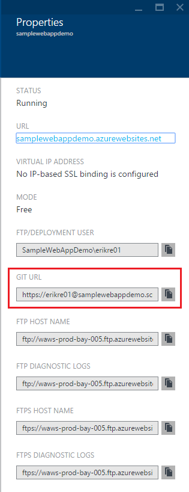
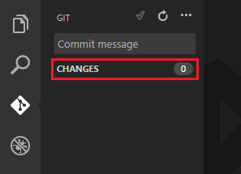

<properties
   pageTitle="Create an ASP.NET 5 web app in Visual Studio Code"
   description="This tutorial illustrates how to create an ASP.NET 5 web app using Visual Studio Code."
   services="app-service\web"
   documentationCenter=".net"
   authors="erikre"
   manager="wpickett"
   editor="jimbe"/>

<tags
	ms.service="app-service-web" 
	ms.workload="web" 
	ms.tgt_pltfrm="dotnet" 
	ms.devlang="na" 
	ms.topic="article" 
	ms.date="12/17/2015" 
	ms.author="erikre"/>

# Create an ASP.NET 5 web app in Visual Studio Code

## Overview

This tutorial shows you how to create an ASP.NET 5 web app using [Visual Studio Code (VS Code)](http://code.visualstudio.com//Docs/whyvscode) and deploy it to [Azure App Service](../app-service/app-service-value-prop-what-is.md). 

> [AZURE.NOTE] Although this article refers to web apps, it also applies to API apps and mobile apps. 

ASP.NET 5 is a significant redesign of ASP.NET. ASP.NET 5 is a new open-source and cross-platform framework for building modern cloud-based web apps using .NET. For more information, see [Introduction to ASP.NET 5](http://docs.asp.net/en/latest/conceptual-overview/aspnet.html). For information about Azure App Service web apps, see [Web Apps Overview](app-service-web-overview.md).

[AZURE.INCLUDE [app-service-web-try-app-service.md](../../includes/app-service-web-try-app-service.md)]

## Prerequisites  

* Install [VS Code](http://code.visualstudio.com/Docs/setup).
* Install [Node.js](http://nodejs.org) - Node.js is a platform for building fast and scalable server applications using JavaScript. Node is the runtime (Node), and [npm](http://www.npmjs.com/) is the Package Manager for Node modules. You will use npm to scaffold an ASP.NET 5 web app in this tutorial.
* Install Git - You can install it from either of these locations: [Chocolatey](https://chocolatey.org/packages/git) or [git-scm.com](http://git-scm.com/downloads). If you are new to Git, choose [git-scm.com](http://git-scm.com/downloads) and select the option to **Use Git from the Windows Command Prompt**. Once you install Git, you'll also need to set the Git user name and email as it's required later in the tutorial (when performing a commit from VS Code).  

## Install ASP.NET 5 and DNX
ASP.NET 5/DNX (the .NET Execution Environment) is a lean .NET stack for building modern cloud and web apps that run on OS X, Linux, and Windows. It has been built from the ground up to provide an optimized development framework for apps that are either deployed to the cloud or run on-premises. It consists of modular components with minimal overhead, so you retain flexibility while constructing your solutions.

This tutorial is designed to get you started building applications with the latest development versions of ASP.NET 5 and DNX. The following instructions are specific to Windows. For more detailed installation instructions for OS X, Linux, and Windows, see [Installing ASP.NET 5 and DNX](https://code.visualstudio.com/Docs/ASPnet5#_installing-aspnet-5-and-dnx). 

1. To install .NET Version Manager (DNVM) in Windows, open a command prompt, and run the following command.

		@powershell -NoProfile -ExecutionPolicy unrestricted -Command "&{$Branch='dev';iex ((new-object net.webclient).DownloadString('https://raw.githubusercontent.com/aspnet/Home/dev/dnvminstall.ps1'))}"

	This will download the DNVM script and put it in your user profile directory. 

2. **Restart Windows** to complete the DNVM installation. 

	After you have restarted Windows, you can open the command prompt to verify the location of DNVM by entering the following:

		where dnvm

	The command prompt will show a path similar to the following.

	

3. Now that you have DNVM, you must to use it to download DNX to run your applications. Run the following at the command prompt:

		dnvm upgrade

	Verify your DNVM, and view the active runtime by entering the following at the command prompt:

		dnvm list

	The command prompt will show the details of the active runtime.

	

	If more than one DNX runtime is listed, you can choose to enter the following (or a more recent version) at the command prompt to set the active DNX runtime. Set it to the same version that is used by the ASP.NET 5 generator when you create your web app later in this tutorial. *You may not need to change the active runtime if it is set to the latest available.*

		dnvm use 1.0.0-update1 –p

> [AZURE.NOTE] For more detailed installation instructions for OS X, Linux, and Windows, see [Installing ASP.NET 5 and DNX](https://code.visualstudio.com/Docs/ASPnet5#_installing-aspnet-5-and-dnx). 

## Create the web app 

This section shows you how to scaffold a new app ASP.NET web app. You will use the node package manager (npm) to install [Yeoman](http://yeoman.io/) (application scaffolding tool - the VS Code equivalent of the Visual Studio **File > New Project** operation), [Grunt](http://gruntjs.com/) (JavaScript task runner), and [Bower](http://bower.io/) (client side package manager). 

1. Open a command prompt with Administrator rights and navigate to the location where you want to create your ASP.NET project. For instance, create a *vscodeprojects* directory at the root of C:\.

2. Enter the following at the command prompt to install Yeoman and the supporting tools.

		npm install -g yo grunt-cli generator-aspnet bower

	> [AZURE.NOTE] You may get a warning suggesting that your npm version is out of date. This warning should not affect this tutorial.

3. Enter the following at the command prompt to create the project folder and scaffold the app.

		yo aspnet

4. Use the arrow keys to select the **Web Application Basic** type from the ASP.NET 5 generator menu, and press **&lt;Enter>**.

	

5. Set the name of your new ASP.NET web app to **SampleWebApp**. As this name is used throughout the tutorial, if you select a different name, you'll need to substitute it for each occurrence of **SampleWebApp**. When you press **&lt;Enter>**, Yeoman will create a new folder named **SampleWebApp** and the necessary files for your new app.

6. At the command prompt, change directories to your new project folder:

		cd SampleWebApp

7. Also at the command prompt, to install the necessary NuGet packages to run the application, enter the following command:

		dnu restore

8. Open VS Code by entering the following at the command prompt:

		code .

## Run the web app locally

Now that you have created the web app and retrieved all the NuGet packages for the app, you can run the web app locally.

1. From the **Command Palette** in VS Code, enter the following to show the available run command options:

		dnx: Run Command

	> [AZURE.NOTE] If the Omnisharp server is not currently running, it will start up. Re-enter the above command.

	Next, select the following command to run your web app:
		
		dnx web - (SampleWebApp)

	The command window will display that the application has started. If the command window doesn't display this message, check the lower left corning of VS Code for errors in your project.
	
	> [AZURE.NOTE] Issuing a command from the **Command Palette** requires a **>** character at the beginning of the command line. You can view the details related to the **web** command in the *project.json* file. 

2. Open a browser and navigate to the following URL.

	**http://localhost:5000**

	The default page of the web app will appear as follows.

	

3. Close your browser. In the **Command Window**, press **Ctrl+C** to shut down the application and close the **Command Window**. 

## Create a web app in the Azure Portal

The following steps will guide you through creating a web app in the Azure Portal.

1. Log in to the [Azure Portal](https://portal.azure.com).

2. Click **NEW** at the top left of the Portal.

3. Click **Web Apps > Web App**.

	

4. Enter a value for **Name**, such as **SampleWebAppDemo**. Note that this name needs to be unique, and the portal will enforce that when you attempt to enter the name. Therefore, if you select a enter a different value, you'll need to substitute that value for each occurrence of **SampleWebAppDemo** that you see in this tutorial. 

5. Select an existing **App Service Plan** or create a new one. If you create a new plan, select the pricing tier, location, and other options. For more information on App Service plans, see the article, [Azure App Service plans in-depth overview](../app-service/azure-web-sites-web-hosting-plans-in-depth-overview.md).

	

6. Click **Create**.

	

## Enable Git publishing for the new web app

Git is a distributed version control system that you can use to deploy your Azure App Service web app. You'll store the code you write for your web app in a local Git repository, and you'll deploy your code to Azure by pushing to a remote repository.   

1. Log into the [Azure Portal](https://portal.azure.com).

2. Click **Browse**.

3. Click **Web Apps** to view a list of the web apps associated with your Azure subscription.

4. Select the web app you created in this tutorial.

5. In the web app blade, scroll down to locate the **Deployment** section, and click **Set up continuous deployment**. 

	

6. Click **Choose Source > Local Git Repository**.

7. Click **OK**.

	

8. If you have not previously set up deployment credentials for publishing a web app or other App Service app, set them up now:

	* Click **Settings** > **Deployment credentials**. The **Set deployment credentials** blade will be displayed.

	* Create a user name and password.  You'll need this password later when setting up Git.

	* Click **Save**.

9. In your web app's blade, click **Settings > Properties**. The URL of the remote Git repository that you'll deploy to is shown under **GIT URL**.

10. Copy the **GIT URL** value for later use in the tutorial.

	

## Publish your web app to Azure App Service

In this section, you will create a local Git repository and push from that repository to Azure to deploy your web app to Azure.

1. In VS Code, select the **Git** option in the left navigation bar.

	

2. Select **Initialize git repository** to make sure your workspace is under git source control. 

	

3. Open the Command Window and change directories to the directory of your web app. Then, enter the following command:

		git config core.autocrlf false

	This command prevents an issue about text where CRLF endings and LF endings are involved.

4. In VS Code, add a commit message and click the **Commit All** check icon.

	

5. After Git has completed processing, you'll see that there are no files listed in the Git window under **Changes**. 

	

6. Change back to the Command Window where the command prompt points to the directory where your web app is located.

7. Create a remote reference for pushing updates to your web app by using the Git URL (ending in ".git") that you copied earlier.

		git remote add azure [URL for remote repository]

8. Configure Git to save your credentials locally so that they will be automatically appended to your push commands generated from VS Code.

		git config credential.helper store

9. Push your changes to Azure by entering the following command. After this initial push to Azure, you will be able to do all the push commands from VS Code. 

		git push -u azure master

	You are prompted for the password you created earlier in Azure. **Note: Your password will not be visible.**

	The output from the above command ends with a message that deployment is successful.

		remote: Deployment successful.
		To https://user@testsite.scm.azurewebsites.net/testsite.git
		[new branch]      master -> master

> [AZURE.NOTE] If you make changes to your app, you can republish directly in VS Code using the built-in Git functionality by selecting the **Commit All** option followed by the **Push** option. You will find the **Push** option available in the drop-down menu next to the **Commit All** and **Refresh** buttons.

If you need to collaborate on a project, you should consider pushing to GitHub in between pushing to Azure.

## Run the app in Azure
Now that you have deployed your web app, let's run the app while hosted in Azure. 

This can be done in two ways:

* Open a browser and enter the name of your web app as follows.   

		http://SampleWebAppDemo.azurewebsites.net
 
* In the Azure Portal, locate the web app blade for your web app, and click **Browse** to view your app 
* in your default browser.

## Summary
In this tutorial, you learned how to create a web app in VS Code and deploy it to Azure. For more information about VS Code, see the article, [Why Visual Studio Code?](https://code.visualstudio.com/Docs/) For information about App Service web apps, see [Web Apps Overview](app-service-web-overview.md). 
