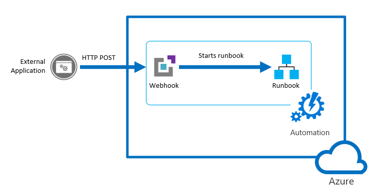
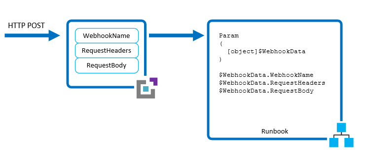
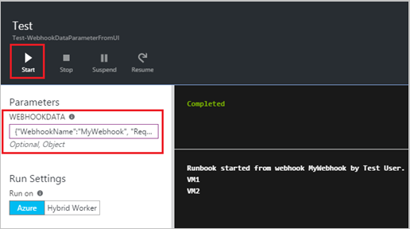
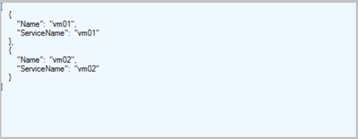

<properties 
   pageTitle="Azure Automation webhooks | Microsoft Azure"
   description="A webhook that allows a client to start a runbook in Azure Automation from an HTTP call.  This article describes how to create a webhook and how to call one to start a runbook."
   services="automation"
   documentationCenter=""
   authors="SnehaGunda"
   manager="stevenka"
   editor="tysonn" />
<tags 
   ms.service="automation"
   ms.devlang="na"
   ms.topic="article"
   ms.tgt_pltfrm="na"
   ms.workload="infrastructure-services"
   ms.date="12/07/2015"
   ms.author="bwren;sngun"/>

# Azure Automation webhooks

A *webhook* allows you to start a particular runbook in Azure Automation through a single HTTP request. This allows external services such as Visual Studio Team Services, GitHub, or custom applications to start runbooks without implementing a full solution using the Azure Automation API.  

You can compare webhooks to other methods of starting a runbook in [Starting a runbook in Azure Automation](automation-starting-a-runbook.md)

## Details of a webhook

The following table describes the properties that you must configure for a webhook.

| Property | Description |
|:---|:---|
|Name | You can provide any name you want for a webhook since this is not exposed to the client.  It is only used for you to identify the runbook in Azure Automation.    As a best practice, you should give the webhook a name related to the client that will use it. |
|URL |The URL of the webhook is the unique address that a client calls with an HTTP POST to start the runbook linked to the webhook.  It is automatically generated when you create the webhook.  You cannot specify a custom URL.      The URL contains a security token that allows the runbook to be invoked by a third party system with no further authentication. For this reason, it should be treated like a password.  For security reasons, you can only view the URL in the Azure preview portal at the time the webhook is created. You should note the URL in a secure location for future use.   |
|Expiration date | Like a certificate, each webhook has an expiration date at which time it can no longer be used.  This expiration date cannot be changed after the webhook is created, and the webhook also cannot be enabled again after the expiration date is reached.  In this case, you must create another webhook to replace the current one and update the client to use the new webhook. |
| Enabled | A webhook is enabled by default when it is created.  If you set it to Disabled, then no client will be able to use it.  You can set the **Enabled** property when you create the webhook or anytime once it is created. |

### Parameters
A webhook can define values for runbook parameters that are used when the runbook is started by that webhook. The webhook must include values for any mandatory parameters of the runbook and may include values for optional parameters. A parameter value configured to a webhook can be modified even after creating the webhoook. Multiple webhooks linked to a single runbook can each use different parameter values. 

When a client starts a runbook using a webhook, it cannot override the parameter values defined in the webhook.  To receive data from the client, the runbook can accept a single parameter called **$WebhookData** of type [object] that will contain data that the client includes in the POST request. 

The **$WebhookData** object will have the following properties:

| Property | Description |
|:--- |:---|
| WebhookName | The name of the webhook.  |
| RequestHeader | Hash table containing the headers of the incoming POST request. |
| RequestBody | The body of the incoming POST request.  This will retain any formatting such as string, JSON, XML, or form encoded data. The runbook must be written to work with the data format that is expected.|

There is no configuration of the webhook required to support the **$WebhookData** parameter, and the runbook is not required to accept it.  If the runbook does not define the parameter, then any details of the request sent from the client is ignored.

If you specify a value for $WebhookData when you create the webhook, that value will be overriden when the webhook starts the runbook with the data from the client POST request, even if the client does not include any data in the request body.  If you start a runbook that has $WebhookData using a method other than a webhook, you can provide a value for $Webhookdata that will be recognized by the runbook.  This value should be an object with the same [properties](#details-of-a-webhook) as $Webhookdata so that the runbook can properly work with it as if it was working with actual WebhookData passed by a webhook.

For example, if you are starting the following runbook from the Azure Portal and want to pass some sample WebhookData for testing, since WebhookData is an object, it should be passed as JSON in the UI.

For the above runbook, if you have the following properties for the WebhookData parameter:

1. WebhookName: *MyWebhook*
2. RequestHeader: *From=Test User*
3. RequestBody: *[“VM1”, “VM2”]*

Then you would pass the following JSON value in the UI for the WebhookData parameter:  

* {"WebhookName":"MyWebhook", "RequestHeader":{"From":"Test User"}, "RequestBody":"[\"VM1\",\"VM2\"]"}

>[AZURE.NOTE] The values of all input parameters are logged with the runbook job.  This means that any input provided by the client in the webhook request will be logged and available to anyone with access to the automation job.  For this reason, you should be cautious about including sensitive information in webhook calls.

## Security

The security of a webhook relies on the privacy of its URL which contains a security token that allows it to be invoked. Azure Automation does not perform any authentication on the request as long as it is made to the correct URL. For this reason, webhooks should not be used for runbooks that perform highly sensitive functions without using an alternate means of validating the request.

You can include logic within the runbook to determine that it was called by a webhook by checking the **WebhookName** property of the $WebhookData parameter. The runbook could perform further validation by looking for particular information in the **RequestHeader** or **RequestBody** properties.

Another strategy is to have the runbook perform some validation of an external condition when it received a webhook request.  For example, consider a runbook that is called by GitHub whenever there is a new commit to a GitHub repository.  The runbook might connect to GitHub to validate that a new commit had actually just occurred before continuing.

## Creating a webhook

Use the following procedure to create a new webhook linked to a runbook in the Azure preview portal.

1. From the **Runbooks blade** in the Azure preview portal, click the runbook that the webhook will start to view its detail blade. 
3. Click **Webhook** at the top of the blade to open the **Add Webhook** blade.  

4. Click **Create new webhook** to open the **Create webhook blade**.
5. Specify a **Name**, **Expiration Date** for the webhook and whether it should be enabled. See [Details of a webhook](#details-of-a-webhook) for more information these properties.
6. Click the copy icon and press Ctrl+C to copy the URL of the webhook.  Then record it in a safe place.  **Once you create the webhook, you cannot retrieve the URL again.**  

3. Click **Parameters** to provide values for the runbook parameters.  If the runbook has mandatory parameters, then you will not be able to create the webhook unless values are provided.
1. Click **Create** to create the webhook.

## Using a webhook

To use a webhook after it has been created, your client application must issue an HTTP POST with the URL for the webhook.  The syntax of the webhook will be in the following format.

	http://<Webhook Server>/token?=<Token Value>

The client will receive one of the following return codes from the POST request.  

| Code | Text | Description |
|:---|:----|:---|
| 202 | Accepted | The request was accepted, and the runbook was successfully queued. |
| 400 | Bad Request | The request was not accepted for one of the following reasons. <ul> <li>The webhook has expired.</li> <li>The webhook is disabled.</li> <li>The token in the URL is invalid.</li>  </ul>|
| 404 | Not Found |  The request was not accepted for one of the following reasons. <ul> <li>The webhook was not found.</li> <li>The runbook was not found.</li> <li>The account was not found.</li>  </ul> |
| 500 | Internal Server Error | The URL was valid, but an error occurred.  Please resubmit the request.  |

Assuming the request is successful, the webhook response contains the job id in JSON format as follows. It will contain a single job id, but the JSON format allows for potential future enhancements.

	{"JobIds":["<JobId>"]}  

The client cannot determine when the runbook job completes or its completion status from the webhook.  It can determine this information using the job id with another method such as [Windows PowerShell](http://msdn.microsoft.com/library/azure/dn690263.aspx) or the [Azure Automation API](https://msdn.microsoft.com/library/azure/mt163826.aspx).

### Example

The following example uses Windows PowerShell to start a runbook with a webhook.  Note that any language that can make an HTTP request can use a webhook; Windows PowerShell is just used here as an example.

The runbook is expecting a list of virtual machines formatted in JSON in the body of the request. We also are including information about who is starting the runbook and the date and time it is being started in the header of the request.      

	$uri = "https://s1events.azure-automation.net/webhooks?token=8ud0dSrSo%2fvHWpYbklW%3c8s0GrOKJZ9Nr7zqcS%2bIQr4c%3d"
	$headers = @{"From"="user@contoso.com";"Date"="05/28/2015 15:47:00"}
    
    $vms  = @(
    			@{ Name="vm01";ServiceName="vm01"},
    			@{ Name="vm02";ServiceName="vm02"}
    		)
	$body = ConvertTo-Json -InputObject $vms 

	$response = Invoke-RestMethod -Method Post -Uri $uri -Headers $headers -Body $body
	$jobid = ConvertFrom-Json $response 

The following image shows the header information (using a [Fiddler](http://www.telerik.com/fiddler) trace) from this request. This includes standard headers of an HTTP request in addition to the custom Date and From headers that we added.  Each of these values is available to the runbook in the **RequestHeaders** property of **WebhookData**. 

The following image shows the body of the request (using a [Fiddler](http://www.telerik.com/fiddler) trace)  that is available to the runbook in the **RequestBody** property of **WebhookData**. This is formatted as JSON because that was the format that was included in the body of the request.     

The following image shows the request being sent from Windows PowerShell and the resulting response.  The job id is extracted from the response and converted to a string.

The following sample runbook accepts the previous example request and starts the virtual machines specified in the request body.

	workflow Test-StartVirtualMachinesFromWebhook
	{
		param (	
			[object]$WebhookData
		)

		# If runbook was called from Webhook, WebhookData will not be null.
		if ($WebhookData -ne $null) {	
			
			# Collect properties of WebhookData
			$WebhookName 	= 	$WebhookData.WebhookName
			$WebhookHeaders = 	$WebhookData.RequestHeader
			$WebhookBody 	= 	$WebhookData.RequestBody
			
			# Collect individual headers. VMList converted from JSON.
			$From = $WebhookHeaders.From
			$VMList = ConvertFrom-Json -InputObject $WebhookBody
			Write-Output "Runbook started from webhook $WebhookName by $From."
			
			# Authenticate to Azure resources
			$Cred = Get-AutomationPSCredential -Name 'MyAzureCredential'
			Add-AzureAccount -Credential $Cred
			
            # Start each virtual machine
			foreach ($VM in $VMList)
			{
				$VMName = $VM.Name
				Write-Output "Starting $VMName"
				Start-AzureVM -Name $VM.Name -ServiceName $VM.ServiceName
			}
		}
		else {
			Write-Error "Runbook mean to be started only from webhook." 
		} 
	}

## Starting runbooks in response to Azure alerts

Webhook-enabled runbooks can be used to react to [Azure alerts](../azure-portal/insights-receive-alert-notifications.md). Resources in Azure can be monitored by collecting the statistics like performance, availability and usage with the help of Azure alerts. You can receive an alert based on monitoring metrics or events for your Azure resources, currently Automation Accounts support only metrics. When the value of a specified metric exceeds the threshold assigned or if the configured event is triggered then a notification is sent to the service admin or co-admins to resolve the alert, for more information on metrics and events please refer to [Azure alerts](../azure-portal/insights-receive-alert-notifications.md).

Besides using Azure alerts as a notification system, you can also kick off runbooks in response to alerts. Azure Automation provides the capability to run webhook-enabled runbooks with Azure alerts. When a metric exceeds the configured threshold value then the alert rule becomes active and triggers the automation webhook which in turn executes the runbook.

### Alert Context

Consider an Azure resource such as a virtual machine, CPU utilization of this machine is one of the key performance metric. If the CPU utilization is 100% or more than a certain amount for long period of time, you might want to restart the virtual machine to fix the problem. This can be solved by configuring an alert rule to the virtual machine and this rule takes CPU percentage as its metric. CPU percentage here is just taken as an example but there are many other metrics that you can configure to your Azure resources and restarting the virtual machine is an action that is taken to fix this issue, you can configure the runbook to take other actions.

When this the alert rule becomes active and triggers the webhook-enabled runbook, it sends the alert context to the runbook. [Alert context](../azure-portal/insights-receive-alert-notifications.md) contains details including **SubscriptionID**, **ResourceGroupName**, **ResourceName**, **ResourceType**, **ResourceId** and **Timestamp** which are required for the runbook to identify the resource on which it will be taking action. Alert context is embedded in the body part of the **WebhookData** object sent to the runbook and it can be accessed with **Webhook.RequestBody** property

### Example

Create an Azure virtual machine in your subscription and associate an [alert to monitor CPU percentage metric](../azure-portal/insights-receive-alert-notifications.md). While creating the alert make sure you populate the webhook field with the URL of the webhook which was generated while creating the webhook.

The following sample runbook is triggered when the alert rule becomes active and it collects the Alert context parameters which are required for the runbook to identify the resource on which it will be taking action.

	workflow Invoke-RunbookUsingAlerts
	{
	    param (  	
	        [object]$WebhookData 
	    ) 

	    # If runbook was called from Webhook, WebhookData will not be null.
	    if ($WebhookData -ne $null) {   
	        # Collect properties of WebhookData. 
	        $WebhookName    =   $WebhookData.WebhookName 
	        $WebhookBody    =   $WebhookData.RequestBody 
	        $WebhookHeaders =   $WebhookData.RequestHeader 

	        # Outputs information on the webhook name that called This 
	        Write-Output "This runbook was started from webhook $WebhookName." 

	        
			# Obtain the WebhookBody containing the AlertContext 
			$WebhookBody = (ConvertFrom-Json -InputObject $WebhookBody) 
	        Write-Output "`nWEBHOOK BODY" 
	        Write-Output "=============" 
	        Write-Output $WebhookBody 

	        # Obtain the AlertContext     
	        $AlertContext = [object]$WebhookBody.context

	        # Some selected AlertContext information 
	        Write-Output "`nALERT CONTEXT DATA" 
	        Write-Output "===================" 
	        Write-Output $AlertContext.name 
	        Write-Output $AlertContext.subscriptionId 
	        Write-Output $AlertContext.resourceGroupName 
	        Write-Output $AlertContext.resourceName 
	        Write-Output $AlertContext.resourceType 
	        Write-Output $AlertContext.resourceId 
	        Write-Output $AlertContext.timestamp 

	    	# Act on the AlertContext data, in our case restarting the VM. 
	    	# Authenticate to your Azure subscription using Organization ID to be able to restart that Virtual Machine. 
	        $cred = Get-AutomationPSCredential -Name "MyAzureCredential" 
	        Add-AzureAccount -Credential $cred 
	        Select-AzureSubscription -subscriptionName "Visual Studio Ultimate with MSDN" 
	      
	        #Check the status property of the VM
	        Write-Output "Status of VM before taking action"
	        Get-AzureVM -Name $AlertContext.resourceName -ServiceName $AlertContext.resourceName
	        Write-Output "Restarting VM"

	        # Restart the VM by passing VM name and Service name which are same in this case
	        Restart-AzureVM -ServiceName $AlertContext.resourceName -Name $AlertContext.resourceName 
	        Write-Output "Status of VM after alert is active and takes action"
	        Get-AzureVM -Name $AlertContext.resourceName -ServiceName $AlertContext.resourceName
	    } 
	    else  
	    { 
	        Write-Error "This runbook is meant to only be started from a webhook."  
	    }  
	}

 

## Next Steps

- For details on different ways to start a runbook, see [Starting a Runbook](automation-starting-a-runbook.md)
- For information on viewing the Status of a Runbook Job, refer to [Runbook execution in Azure Automation](automation-runbook-execution.md)
- [Using Azure Automation to take actions on Azure Alerts](https://azure.microsoft.com/blog/using-azure-automation-to-take-actions-on-azure-alerts/)
