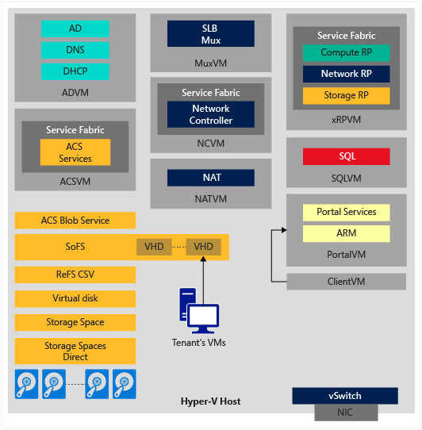

<properties
	pageTitle="Microsoft Azure Stack POC architecture | Microsoft Azure"
	description="View the Microsoft Azure Stack POC architecture."
	services="azure-stack"
	documentationCenter=""
	authors="ErikjeMS"
	manager="v-kiwhit"
	editor=""/>

<tags
	ms.service="azure-stack"
	ms.workload="na"
	ms.tgt_pltfrm="na"
	ms.devlang="na"
	ms.topic="article"
	ms.date="01/29/2016"
	ms.author="erikje"/>

# Microsoft Azure Stack POC architecture

The Azure Stack POC is a one-node deployment of Azure Stack Technical Preview 1. All the components are installed on the host machine, and in the virtual machines of the deployment. The following diagram illustrates the logical architecture of the Azure Stack POC and its components.

**ADVM** Virtual machine that hosts Active Directory, DNS, and DHCP services for Microsoft Azure Stack. These infrastructure foundational services are required to bring up the Azure Stack as well as the ongoing maintenance.

**ACSVM** Virtual machine that hosts the Azure Consistent Storage services. These services run on the Service Fabric on a dedicated virtual machine.

**MuxVM** Virtual machine that hosts the Microsoft software load balancer component and network multiplexing services.

**NCVM** Virtual machine that hosts the Microsoft network controller component, which is a key component of the Microsoft software-defined networking technology. These services run on the Service Fabric on this dedicated virtual machine.

**NATVM** Virtual machine that hosts the Microsoft network address translation component. This  enables outbound network connectivity from Microsoft Azure Stack.

**xRPVM** Virtual machine that hosts the core resource providers of Microsoft Azure Stack, including the Compute, Network, and Storage resource providers.

**SQLVM** Virtual machine that hosts SQL Servers which is used by various fabric services (ACS and xRP services).

**PortalVM** Virtual machine that hosts the Control Plane (Azure Resource Manager) and Azure portal services and various experiences (including services supporting admin experiences and tenant experiences).

**ClientVM** Virtual machine that is available to developers for installing PowerShell, Visuall Studio, and other tools.

Storage services in the operating system on the physical host include:

**CS Blob Service** Azure Consistent Storage Blob service, which provides blob and table storage services.
**SoFS** Scale-out File Server.
**ReFS CSV** Resilient File System Cluster Shared Volume.
**Virtual Disk**, **Storage Space**, and **Storage Spaces Direct** are the respective underlying storage technology in Windows Server to enable the Microsoft Azure Stack core storage resource provider.

## Next steps

[First scenarios to try](azure-stack-first-scenarios.md)
