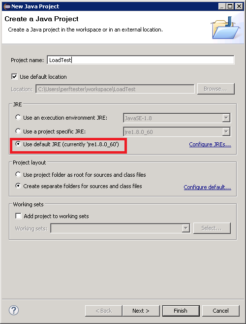
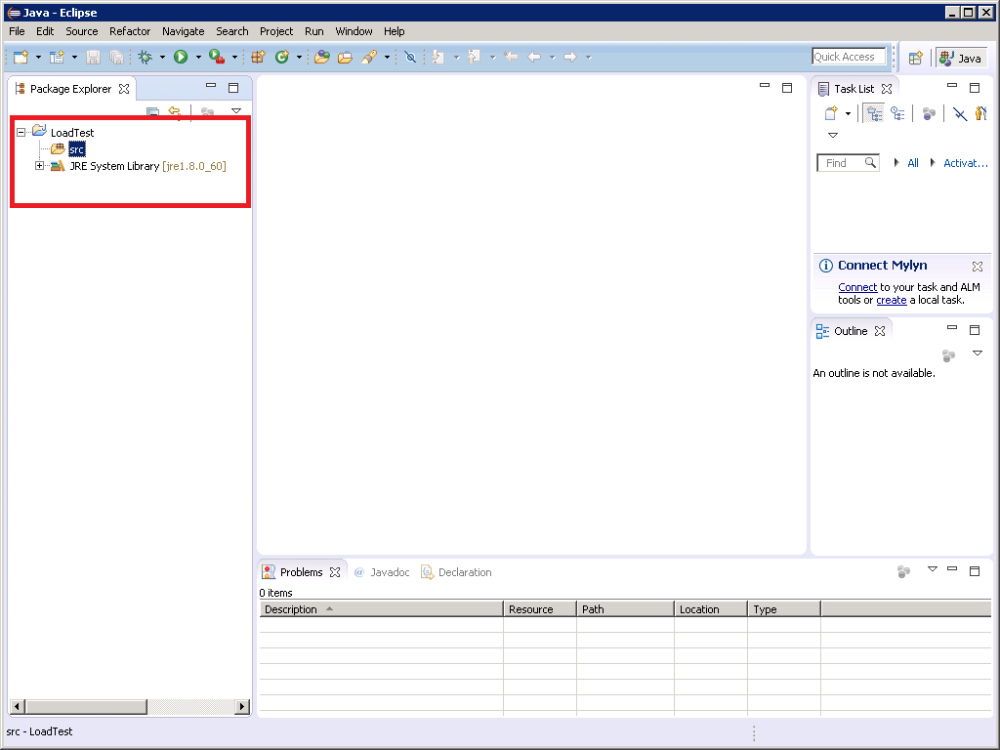
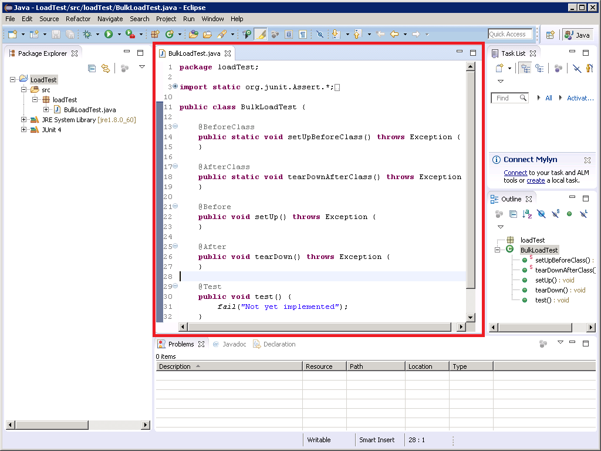
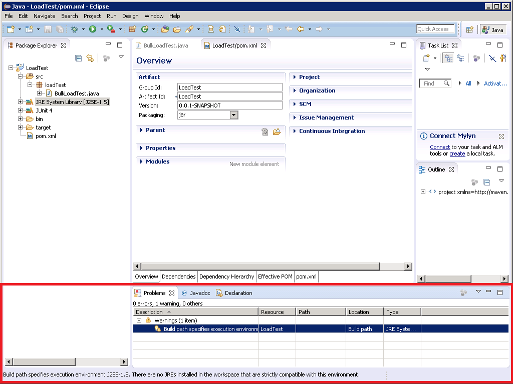
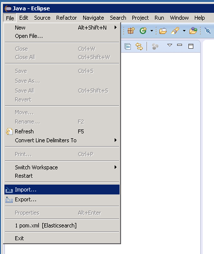
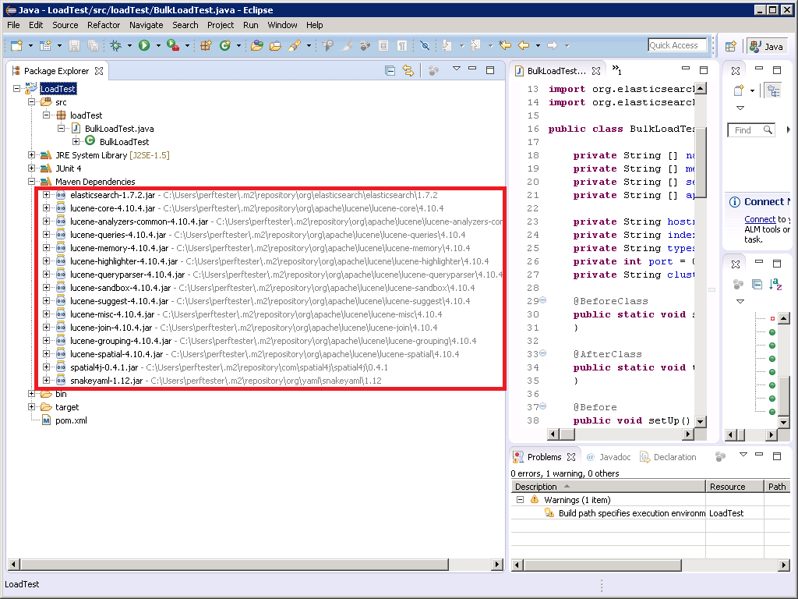
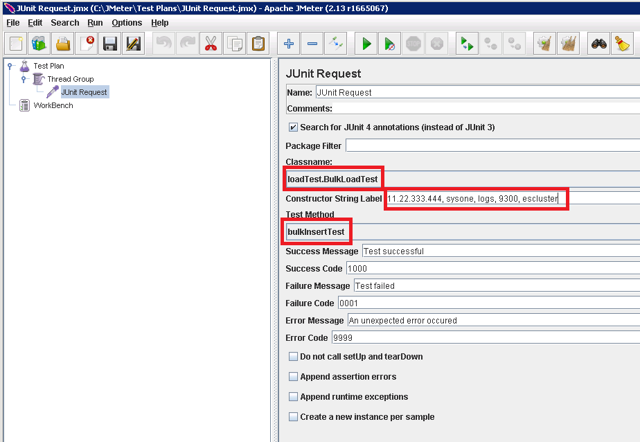

<properties
   pageTitle="Create and Deploy a JMeter JUnit Sampler for Testing Elasticsearch Performance | Microsoft Azure"
   description="How to use a JUnit sampler to generate and upload data to an Elasticsearch cluster."
   services=""
   documentationCenter="na"
   authors="mabsimms"
   manager="marksou"
   editor=""
   tags=""/>

<tags
   ms.service="guidance"
   ms.devlang="na"
   ms.topic="article"
   ms.tgt_pltfrm="na"
   ms.workload="na"
   ms.date="02/05/2016"
   ms.author="mabsimms"/>
   
# Create and Deploy a JMeter JUnit Sampler for Testing Elasticsearch Performance

This article is [part of a series](guidance-elasticsearch-introduction.md). 

This document describes how to create and use a JUnit sampler that can generate and upload data to an Elasticsearch cluster as part of a JMeter test plan. This approach provides a highly flexible approach to load testing that can generate large quantities of test data without depending on external data files.

> [AZURE.NOTE] The load tests used to assess the performance of data ingestion described in the document Maximizing Data Ingestion Performance with Elasticsearch on Azure were constructed using this approach. The details of the JUnit code are described in that document.

For testing data ingestion performance, the JUnit code was developing using Eclipse (Mars), and dependencies were resolved using Maven. The following procedures describe the step by step process for installing Eclipse, configuring Maven, creating a JUnit test, and deploying this test as a JUnit Request sampler in a JMeter test.

> [AZURE.NOTE] For detailed information on the structure and configuration of the test environment, see the document How-To: Create a Performance Testing Environment for Elasticsearch.

## Installing Prerequisites

You will need the [Java Runtime Environment](http://www.java.com/en/download/ie_manual.jsp) on your development machine.
You will also need to install the [Eclipse IDE for Java Developers](https://www.eclipse.org/downloads/index.php?show_instructions=TRUE).

> [AZURE.NOTE] If you are using the JMeter Master VM described in the section [Configuring the Performance Testing Environment](#overview) as your development environment, then download the Windows 32 Bit version of the Eclipse Installer.

## Creating a JUnit Test Project for Load Testing Elasticsearch

1.  Start the Eclipse IDE if it is not already running, and then close the *Welcome* page.

2.  On the *File* menu, click *New*, and then click *Java Project*.

3.  In the *New Java Project* window, enter a project name, select *Use default JRE*, and then click *Finish*.

4.  In the *Package Explorer* window, expand the node named after your project. Verify that it contains a folder named *src* and a reference to the JRE you specified.

5.  Right-click the *src* folder, click *New*, and then click *JUnit Test Case*.

6.  In the *New JUnit Test Case* window, select *New Junit 4 test*, enter a name for the package (this can be the same as the name of the project, although by convention it should start with a lower case letter), a name for the test class, and select the options that generate the method stubs required for your test. Leave the *Class under test* box empty, and then click *Finish*.

7.  If the following *New JUnit Test Case* dialog box appears, specify the option to add the JUnit 4 library to the build path and then click *OK*.

8.  Verify that the skeleton code for the JUnit test is generated and displayed in the Java editor window.

9.  In the *Package Explorer*, right-click the node for your project, click *Configure*, and then click *Convert to Maven Project*.

> [AZURE.NOTE] Using Maven enables you to more easily manage external dependencies (such as the Elasticsearch Java client libraries) on which a project depends.

10.  In the *Create new POM* dialog box, in the *Packaging* drop-down list box, select *jar*, and then click *Finish*.

11.  The pane that appears below the POM editor might display the warning *Build path specifies execution environment J2SE-1.5. There are no JREs installed in the workspace that are strictly compatible with this environment*, depending on which version of Java you have installed on your development machine. If you have a version of Java that is later than version 1.5 you can safely ignore this warning.

12.  In the POM editor, expand *Properties* and then click *Create*.

13.  In the *Add Property* dialog box, in the *Name* box type *es.version*, in the *Value* box type *1.7.2*, and then click *OK*. This is the version of the Elasticsearch Java client library to use (this version may be superseded in the future, and defining the version as a POM property and referencing this property from elsewhere within the project enables the version to be changed quickly.)

14.  Click the *Dependencies* tab at the base of the POM editor, and then click *Add* next to the *Dependencies* list box.

15.  In the *Select Dependency* dialog box, in the *Group Id* box type *org.elasticsearch*, in the *Artifact Id* box type *elasticsearch*, in the *Version* box type *\${es.version}*, and then click *OK*. Information about the java Elasticsearch client library is held in the online Maven Central repository, and this configuration will automatically download the library and its dependencies when the project is built.

16.  On *File* menu, click *Save All*. This action will save and build the project, downloading the dependencies specified by Maven. Verify that the *Maven Dependencies* folder appears in Package Explorer. Expand this folder to view the jar files downloaded to support the Elasticsearch Java client library.

## Importing an Existing JUnit Test Project into Eclipse

> [AZURE.NOTE] This procedure assumes that you have downloaded a Maven project that was previously created by using Eclipse.

1.  Start the Eclipse IDE.

2.  On the *File* menu, click *Import*.

3.  In the *Select* window, expand the *Maven* folder, click *Existing Maven Projects*, and then click *Next*.

4.  In the *Maven Projects* window, specify the folder holding the project (the folder containing the pom.xml file), click *Select All*, and then click *Finish*.

5.  In the *Package Explorer* window, expand the node corresponding to your project. Verify that the project contains a folder named *src*. This folder contains the source code for the JUnit test. The project can be compiled and deployed following the instructions in the procedure [Deploying a JUnit Test to JMeter](#deploying-a-junit-test-to-jmeter).

## Deploying a JUnit Test to JMeter

> [AZURE.NOTE] This project assumes you have created a project named LoadTest containing a JUnit Test class named BulkLoadTest.java that accepts configuration parameters passed in as a single string to a constructor (this is the mechanism that JMeter expects).

1.  In the Eclipse IDE, in Package Explorer, right-click the project node and then click *Export*.

2.  In the *Export Wizard*, on the *Select* page, expand the *Java* node, click *JAR file*, and then click *Next*.

3.  On the *JAR File Specification* page, in the *Select the resources to export* box, expand the project being exported and deselect everything except the *src* folder, deselect *.classpath*, deselect *.project*, and deselect *pom.xml*. In the *JAR file* box, provide a file name and location for the JAR (it should be given the .jar file extension), and then click *Finish*.

4.  Using Windows Explorer, copy the JAR file you have just created to the JMeter Master JVM and save it in the *apache-jmeter-2.13\\lib\\junit* folder underneath the folder where you have installed JMeter (see the procedure [Installing and Configuring JMeter on the JMeter Master VM](#_Installing_and_Configuring) for more information.)

5.  Return to Eclipse, expand the Package Explorer window and make a note of all the JAR files and their locations listed in the *Maven Dependencies* folder for the project. Note that the files displayed in the following image might vary, depending on which version of Elasticsearch you are using:

6.  Using Windows Explorer, copy each JAR file referenced in the Maven Dependencies folder to the *apache-jmeter-2.13\\lib\\junit* folder on the JMeter Master VM.

> [AZURE.NOTE] If the l*ib\\junit* folder already contains older versions of these JAR files then remove them. If you leave them in place then the JUnit test might not work as references could be resolved to the wrong JARs.

7.  On the JMeter Master VM, stop JMeter if is currently running.

8.  Start JMeter.

9.  In JMeter, right-click *Test Plan*, click *Add*, click *Threads (Users)*, and then click *Thread Group*.

10.  Under the *Test Plan* node, right-click *Thread-Group*, click *Add*, click *Sampler*, and then click *JUnit Request*.

11.  On the *JUnit Request* page, select *Search for JUnit4 annotations (instead of JUnit 3)*. In the *Classname* drop-down list box, select your JUnit load test class (it will be listed in the form *&lt;package&gt;.&lt;class&gt;*), in the *Test Method* drop-down list box select the JUnit test method (this is the method that actually performs the work associated with the test and should have been marked with the *@test* annotation in the Eclipse project), and enter any values to be passed to the constructor in the *Constructor String Label* box (the details shown in the following image are just examples; your *Classname*, *Test Method*, and *Constructor String Label* will probably differ from those shown).

> [AZURE.NOTE]  If your class does not appear in the *Classname* drop-down list box, it probably means that the JAR was not exported properly or has not been placed in the *lib\\junit* folder, or some of the dependent JARs are missing from the *lib\\junit* folder. If this occurs, export the project from Eclipse again and ensure that you have selected the *src* resource, copy the JAR to the *lib\\junit* folder, and then verify that you have copied all of the dependent JARs listed by Maven to the *lib* folder.

12.  Close JMeter. There is no need to save the test plan.

13.  Copy the JAR file containing the JUnit test class to the */home/&lt;username&gt;/apache-jmeter-2.13/lib/junit* folder on each of the JMeter subordinate VMs (*&lt;username&gt;* is the name of the administrative user you specified when you created the VM; see [Creating the JMeter Subordinate Virtual Machines](#_Creating_the_JMeter_2) for more information.)

14.  Copy the dependent JAR files required by the JUnit test class to the */home/&lt;username&gt;/apache-jmeter-2.13/lib/junit* folder on each of the JMeter subordinate VMs. Make sure to remove any older versions of JAR files from this folder first.

> [AZURE.NOTE] You can use the pscp utility to copy files from a Windows computer to Ubuntu.