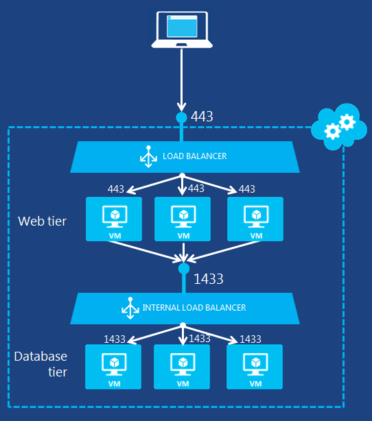
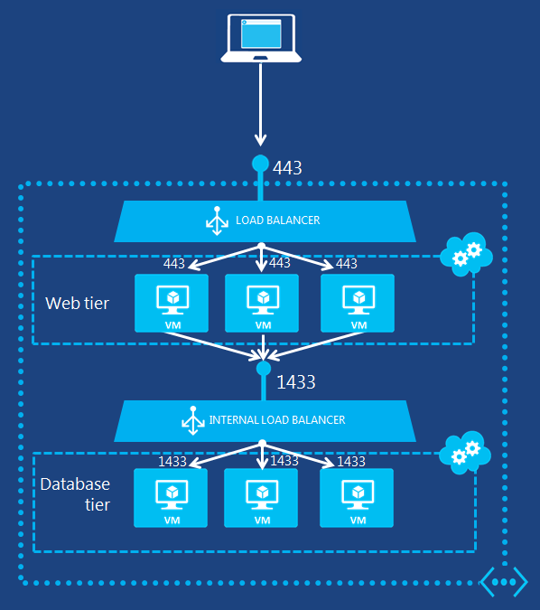
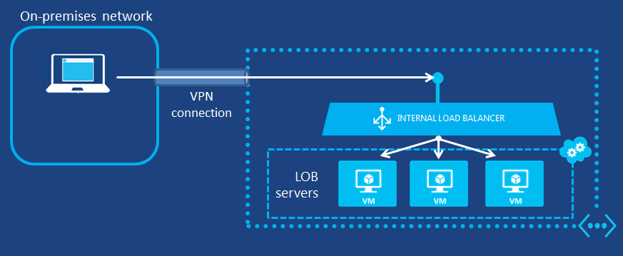
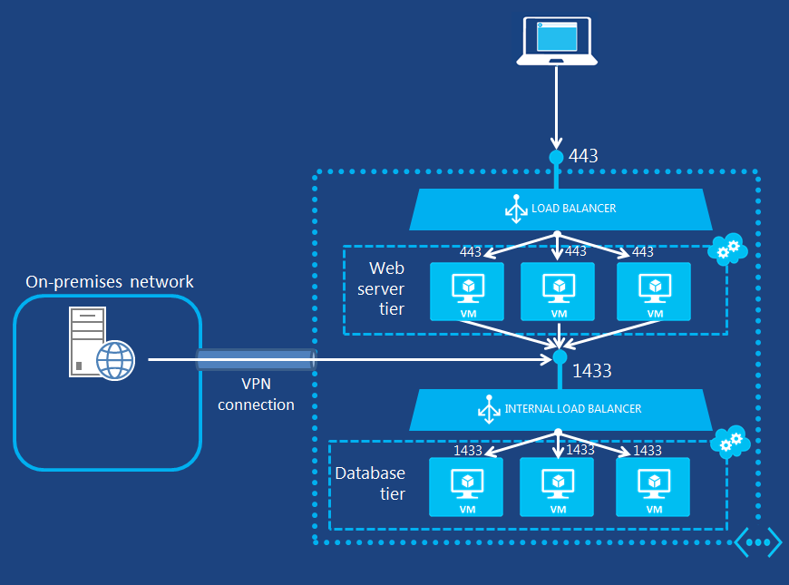

<properties 
   pageTitle="Internal load balancer Overview | Microsoft Azure"
   description="Overview for internal load balancer and its features.How a load balancer works for Azure and possible scenarios to configure internal endpoints"
   services="load-balancer"
   documentationCenter="na"
   authors="joaoma"
   manager="adinah"
   editor="tysonn" />
<tags 
   ms.service="load-balancer"
   ms.devlang="na"
   ms.topic="article"
   ms.tgt_pltfrm="na"
   ms.workload="infrastructure-services"
   ms.date="12/09/2015"
   ms.author="joaoma" />

# Internal Load balancer Overview

Internal Load Balancer (ILB) is a security enhancement over the current Internet facing load balancer that is offered in Azure. Access to the ILB can only be done by resources inside the cloud service or using VPN to access the Azure infrastructure to reach the ILB.
			
The infrastructure  restricts the accessibility and creates a trust boundary between the load balanced virtual IP addresses to a Cloud Service or a Virtual Network and will never be exposed to a Internet endpoint directly. This enables internal Line of Business applications to run in Azure and be accessed within the cloud or from on-premises.

## Scenarios for internal load balancer

You can use ILB in many new configurations, including the following:

Azure Internal Load Balancing (ILB) provides load balancing between virtual machines that reside inside of a cloud service or a virtual network with a regional scope. For information about the use and configuration of virtual networks with a regional scope, see [Regional Virtual Networks](https://azure.microsoft.com/blog/2014/05/14/regional-virtual-networks/) in the Azure blog. Existing virtual networks that have been configured for an affinity group cannot use ILB.

ILB enables the following new types of load balancing:

- Within a cloud service, from virtual machines to a set of virtual machines that reside within the same cloud service (see Figure 1).

- Within a virtual network, from virtual machines in the virtual network to a set of virtual machines that reside within the same cloud service of the virtual network (see Figure 2).

- For a cross-premises virtual network, from on-premises computers to a set of virtual machines that reside within the same cloud service of the virtual network (see Figure 3).

The existing Azure load balancing only provides load balancing between Internet-based computers and virtual machines in a cloud service. ILB enables new capabilities for hosting virtual machines in Azure.

- Internet-facing, multi-tier applications in which the back-end tiers are not Internet-facing but require load balancing for traffic from the Internet-facing tier.
- Load balancing for line-of-business (LOB) applications hosted in Azure without requiring additional load balancer hardware or software.
Including on-premises servers in the set of computers whose traffic is load balanced. 
- The following sections describe these configurations in more detail.

## Internet facing multi-tier applications

The web tier has Internet facing endpoints for Internet clients and is part of a load-balanced set. The load balancer  distributes incoming traffic from web clients for TCP port 443 (HTTPS) to the web servers.

The database servers are behind an ILB endpoint which the web servers use for storage. This database service load balanced endpoint, which traffic is load balanced across the database servers in the ILB set.

The image below describes the Internet facing multi-tier application within the same cloud service. 

Figure 1

Another possible scenario for a multi-tier application is when the ILB deployed to a different cloud service than the one consuming the service for the ILB.

Cloud services using the same virtual network will have access to the ILB endpoint.

You can see in the image below front-end web servers are in a different cloud service from the database back-end and leveraging the ILB endpoint within the same virtual network.

Figure 2

## Intranet Line of business (LOB) applications

Traffic from clients on the on-premises network get load-balanced across the set of LOB servers using VPN connection to Azure network.

The client machine will have access to an IP address from Azure VPN service using point to site VPN .It will allow to use the LOB application hosted behind the ILB endpoint.

Another scenario for the LOB is to have a site to site VPN to the virtual network where the ILB endpoint is configured.This will allow on-premises network traffic to be routed to the ILB endpoint.

## Next Steps

[Get started configuring an Internet facing load balancer](load-balancer-internet-getstarted.md)

[Get started configuring an Internal load balancer](load-balancer-internal-getstarted.md)

[Configure a Load balancer distribution mode](load-balancer-distribution-mode.md)

[Configure idle TCP timeout settings for your load balancer](load-balancer-tcp-idle-timeout.md)

 