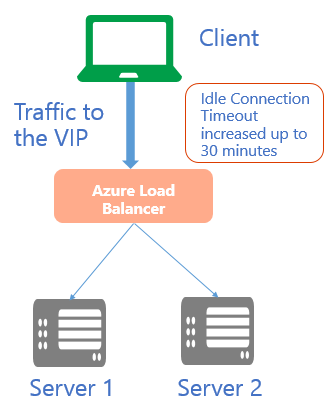

<properties 
   pageTitle="Configure Load balancer TCP idle timeout | Microsoft Azure"
   description="Configure Load balancer TCP idle timeout"
   services="load-balancer"
   documentationCenter="na"
   authors="joaoma"
   manager="adinah"
   editor="tysonn" />
<tags 
   ms.service="load-balancer"
   ms.devlang="na"
   ms.topic="article"
   ms.tgt_pltfrm="na"
   ms.workload="infrastructure-services"
   ms.date="11/19/2015"
   ms.author="joaoma" />

# How to change TCP idle timeout settings for load balancer

In its default configuration, Azure Load Balancer has an ‘idle timeout’ setting of 4 minutes.

This means that if you have a period of inactivity on your tcp or http sessions for more than the timeout value, there is no guarantee to have the connection maintained between the client and your service.

When the connection is closed, your client application will get an error message like “The underlying connection was closed: A connection that was expected to be kept alive was closed by the server”.

A common practice to keep the connection active for a longer period is to use TCP Keep-alive (You can find .NET examples [here](https://msdn.microsoft.com/library/system.net.servicepoint.settcpkeepalive.aspx)).

Packets are sent when no activity is detected on the connection. By keeping on-going network activity, the idle timeout value is never hit and the connection is maintained for a long period.

The idea is to configure the TCP Keep-alive with an interval shorter than the default timeout setting to avoid having the connection dropped or increase the idle timeout value for the TCP connection session stay connected.

While TCP Keep-alive works well for scenarios where battery is not a constraint, it is generally not a valid option for mobile applications. Using TCP Keep-alive from a mobile application will likely drain the device battery faster.

To support such scenarios, we have added support for a configurable idle timeout. You can now set it for a duration between 4 and 30 minutes. This setting works for inbound connections only.

## How to change idle timeout settings in Virtual Machines and cloud services

- Configure TCP timeout to an endpoint on a Virtual Machine via PowerShell or Service Management API
- Configure TCP timeout for your Load-Balanced Endpoint Sets via PowerShell or Service Management API.
- Configure TCP timeout for your Instance-Level Public IP
- Configure TCP timeout for your Web/Worker roles via the service model.
 

>[AZURE.NOTE] Keep in mind some commands will only exist in the latest Azure PowerShell package. If the powershell command doesn't exist, download a latest PowerShell package.

 
### Configure TCP timeout for your Instance-Level Public IP to 15 minutes.

	Set-AzurePublicIP –PublicIPName webip –VM MyVM -IdleTimeoutInMinutes 15

IdleTimeoutInMinutes is optional. If not set, the default timeout is 4 minutes. 

>[AZURE.NOTE] The acceptable timeout range is between 4 and 30 minutes.
 
### Set Idle Timeout when creating an Azure endpoint on a Virtual Machine

In order to change the timeout setting for an endpoint

	Get-AzureVM -ServiceName "mySvc" -Name "MyVM1" | Add-AzureEndpoint -Name "HttpIn" -Protocol "tcp" -PublicPort 80 -LocalPort 8080 -IdleTimeoutInMinutes 15| Update-AzureVM
 
Retrieve your idle timeout configuration

	PS C:\> Get-AzureVM –ServiceName “MyService” –Name “MyVM” | Get-AzureEndpoint
	VERBOSE: 6:43:50 PM - Completed Operation: Get Deployment
	LBSetName : MyLoadBalancedSet
	LocalPort : 80
	Name : HTTP
	Port : 80
	Protocol : tcp
	Vip : 65.52.xxx.xxx
	ProbePath :
	ProbePort : 80
	ProbeProtocol : tcp
	ProbeIntervalInSeconds : 15
	ProbeTimeoutInSeconds : 31
	EnableDirectServerReturn : False
	Acl : {}
	InternalLoadBalancerName :
	IdleTimeoutInMinutes : 15
 
### Set the TCP timeout on a load balanced endpoint set

If endpoints are part of a load balanced endpoint set, the TCP timeout must be set on the load balanced endpoint set:

	Set-AzureLoadBalancedEndpoint -ServiceName "MyService" -LBSetName "LBSet1" -Protocol tcp -LocalPort 80 -ProbeProtocolTCP -ProbePort 8080 -IdleTimeoutInMinutes 15
 
### Changing timeout settings for cloud services

You can leverage the Azure SDK for .NET 2.4 to update your Cloud Service.

Endpoint settings for Cloud Services are made in the .csdef. In order to update the TCP timeout for a Cloud Services deployment, a deployment upgrade is required. An exception is if the TCP timeout is only specified for a Public IP. Public IP settings are in the .cscfg, and they can be updated through deployment update and upgrade.

The .csdef changes for endpoint settings are:

	<WorkerRole name="worker-role-name" vmsize="worker-role-size" enableNativeCodeExecution="[true|false]">
	  <Endpoints>
    <InputEndpoint name="input-endpoint-name" protocol="[http|https|tcp|udp]" localPort="local-port-number" port="port-number" certificate="certificate-name" loadBalancerProbe="load-balancer-probe-name" idleTimeoutInMinutes="tcp-timeout" />
	  </Endpoints>
	</WorkerRole>

The .cscfg changes for the timeout setting on Public IPs are:

	<NetworkConfiguration>
 	 <VirtualNetworkSite name="VNet"/>
 	 <AddressAssignments>
    <InstanceAddress roleName="VMRolePersisted">
      <PublicIPs>
        <PublicIP name="public-ip-name" idleTimeoutInMinutes="timeout-in-minutes"/>
      </PublicIPs>
    </InstanceAddress>
 	 </AddressAssignments>
	</NetworkConfiguration>

## Rest API example

You can configure the TCP idle timeout using the service management API
Make sure to add the x-ms-version header  is set to version 2014-06-01 or higher.
 
Update the configuration of the specified load-balanced input endpoints on all Virtual Machines in a deployment
	
	Request

	POST https://management.core.windows.net/<subscription-id>/services/hostedservices/<cloudservice-name>/deployments/<deployment-name>
 

	Response

	<LoadBalancedEndpointList xmlns="http://schemas.microsoft.com/windowsazure" xmlns:i="http://www.w3.org/2001/XMLSchema-instance">
	<InputEndpoint>
	<LoadBalancedEndpointSetName>endpoint-set-name</LoadBalancedEndpointSetName>
	<LocalPort>local-port-number</LocalPort>
	<Port>external-port-number</Port>
	<LoadBalancerProbe>
	<Path>path-of-probe</Path>
	<Port>port-assigned-to-probe</Port>
	<Protocol>probe-protocol</Protocol>
	<IntervalInSeconds>interval-of-probe</IntervalInSeconds>
	<TimeoutInSeconds>timeout-for-probe</TimeoutInSeconds>
	</LoadBalancerProbe>
	<LoadBalancerName>name-of-internal-loadbalancer</LoadBalancerName>
	<Protocol>endpoint-protocol</Protocol>
	<IdleTimeoutInMinutes>15</IdleTimeoutInMinutes>
	<EnableDirectServerReturn>enable-direct-server-return</EnableDirectServerReturn>
	<EndpointACL>
	<Rules>
	<Rule>
	<Order>priority-of-the-rule</Order>
	<Action>permit-rule</Action>
	<RemoteSubnet>subnet-of-the-rule</RemoteSubnet>
	<Description>description-of-the-rule</Description>
	</Rule>
	</Rules>
	</EndpointACL>
	</InputEndpoint>
	</LoadBalancedEndpointList>

## Next Steps

[Internal load balancer overview](load-balancer-internal-overview.md)

[Get started Configuring an Internet facing load balancer](load-balancer-internet-getstarted.md)

[Configure a Load balancer distribution mode](load-balancer-distribution-mode.md)

 