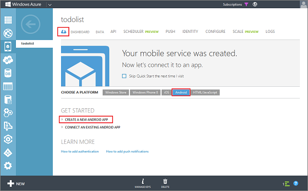

<properties
	pageTitle="Get Started with Azure Mobile Services for Android apps (JavaScript backend)"
	description="Follow this tutorial to get started using Azure Mobile Services for Android development (JavaScript backend)."
	services="mobile-services"
	documentationCenter="android"
	authors="RickSaling"
	manager="dwrede"
	editor=""/>

<tags
	ms.service="mobile-services"
	ms.workload="mobile"
	ms.tgt_pltfrm="mobile-android"
	ms.devlang="java"
	ms.topic="hero-article"
	ms.date="02/05/2016"
	ms.author="ricksal"/>

# Get started with Mobile Services for Android  (JavaScript backend)

[AZURE.INCLUDE [mobile-service-note-mobile-apps](../../includes/mobile-services-note-mobile-apps.md)]

&nbsp;

[AZURE.INCLUDE [mobile-services-selector-get-started](../../includes/mobile-services-selector-get-started.md)]

&nbsp;

[AZURE.INCLUDE [mobile-services-hero-slug](../../includes/mobile-services-hero-slug.md)]

This tutorial shows you how to add a cloud-based backend service to an Android app using Azure Mobile Services. In this tutorial, you will create both a new mobile service and a simple **To do list** app that stores app data in the new mobile service.

> [AZURE.VIDEO mobile-get-started-android]

A screenshot from the completed app is below:

## Prerequisites

Completing this tutorial requires the [Android Developer Tools](https://developer.android.com/sdk/index.html)), which includes the Android Studio integrated development environment, and the latest Android platform. Android 4.2 or a later version is required.

The downloaded quickstart project contains the Azure Mobile Services SDK for Android.

> [AZURE.IMPORTANT] To complete this tutorial, you need an Azure account. If you don't have an account, you can create a free trial account in just a couple of minutes. For details, see [Azure Free Trial](https://azure.microsoft.com/pricing/free-trial/?WT.mc_id=AE564AB28).

## Create a new mobile service

[AZURE.INCLUDE [mobile-services-create-new-service](../../includes/mobile-services-create-new-service.md)]

## Create a new Android app

Once you have created your mobile service, you can follow an easy quickstart in the Azure classic portal to either create a new app or modify an existing app to connect to your mobile service.

In this section you will create a new Android app that is connected to your mobile service.

1.  In the Azure classic portal, click **Mobile Services**, and then click the mobile service that you just created.

2. In the quickstart tab, click **Android** under **Choose platform** and expand **Create a new Android app**.

   	

   	This displays the three easy steps to create an Android app connected to your mobile service.

  	

3. If you haven't already done so, download and install the [Android Developer Tools](https://go.microsoft.com/fwLink/p/?LinkID=280125) on your local computer or virtual machine.

4. Click **Create TodoItem table** to create a table to store app data.

5. Now download your app by pressing the **Download** button.

## Run your Android app

[AZURE.INCLUDE [mobile-services-run-your-app](../../includes/mobile-services-android-get-started.md)]

## Next Steps
Now that you have completed the quickstart, learn how to perform additional important tasks in Mobile Services:

* [Get started with data]
   Learn more about storing and querying data using Mobile Services.

* [Get started with authentication]
   Learn how to authenticate users of your app with an identity provider.

* [Get started with push notifications]
   Learn how to send a very basic push notification to your app.

[AZURE.INCLUDE [app-service-disqus-feedback-slug](../../includes/app-service-disqus-feedback-slug.md)]

<!-- URLs. -->
[Get started (Eclipse)]: mobile-services-android-get-started-ec.md
[Get started with data]: mobile-services-android-get-started-data.md
[Get started with authentication]: mobile-services-android-get-started-users.md
[Get started with push notifications]: mobile-services-javascript-backend-android-get-started-push.md
[Mobile Services Android SDK]: https://go.microsoft.com/fwLink/p/?LinkID=266533

