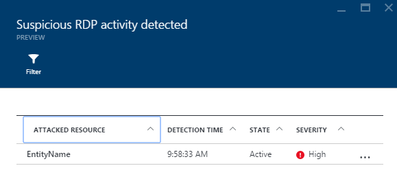
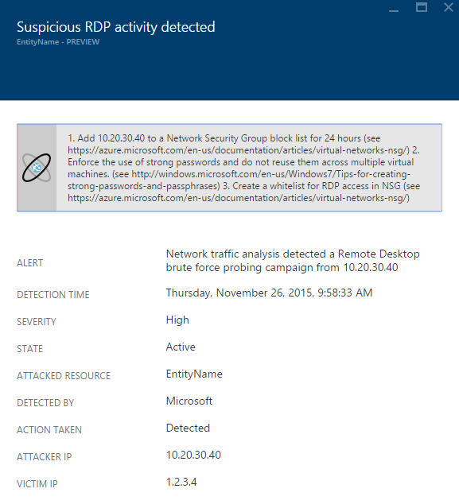

<properties
   pageTitle="Managing and responding to security alerts in Azure Security Center | Microsoft Azure"
   description="This document helps you to use Azure Security Center capabilities to manage and respond to security alerts."
   services="security-center"
   documentationCenter="na"
   authors="YuriDio"
   manager="swadhwa"
   editor=""/>

<tags
   ms.service="security-center"
   ms.devlang="na"
   ms.topic="article"
   ms.tgt_pltfrm="na"
   ms.workload="na"
   ms.date="02/02/2016"
   ms.author="yurid"/>

# Managing and responding to security alerts in Azure Security Center
This document helps you use Azure Security Center capabilities to manage and respond to security alerts.

> [AZURE.NOTE] The information in this document applies to the preview release of Azure Security Center.

## What is Azure Security Center?
 Security Center helps you prevent, detect, and respond to threats with increased visibility into and control over the security of your Azure resources. It provides integrated security monitoring and policy management across your subscriptions, helps detect threats that might otherwise go unnoticed, and works with a broad ecosystem of security solutions.

## What are security alerts?
 Security Center automatically collects, analyzes, and integrates log data from your Azure resources, the network, and partner solutions like antimalware programs and firewalls to detect real threats and reduce false positives. A list of prioritized alerts is surfaced as security alerts.  

You can review your current alerts by looking at the **Security alerts** tile. Follow the steps below to see more details about each alert:

1. On the Security Center dashboard, you will see the **Security alerts** tile.

    

2.  Click the security alerts occurrence icon. The **Security alerts** blade will open with more details about the alerts as shown below.

    

In the bottom part of this blade are the details for each alert. To sort, click the column that you want to sort by. The definition for each column is given below:

- **Alert**: A brief explanation of the alert.
- **Count**: A list of all alerts of this specific type that were detected on a specific day.
- **Detected by**: The service that was responsible for triggering the alert.
- **Date**: The date that the event occurred.
- **State**: The current state for that alert. There are three types of states:
    - **Active**: The security alert has been detected.
    - **Dismissed**: The security alert has been dismissed by the user. This status is typically used for alerts that have been investigated but either mitigated or found not to be an actual attack.

- **Severity**: The severity level, which can be high, medium or low.

### Respond to security alerts
Many activities can indicate a possible attack on your organization. For example, a network administrator performing a legitimate network capture might appear similar to someone launching some form of attack. In other cases, a badly configured system might lead to a number of false positives in an intrusion detection system, which can make it more difficult to spot genuine incidents. After you review the security alerts by using
 Security Center, you can start to take actions based on an alert’s severity.

To take an action, select the alert that you want to respond to, and a new blade will open on the right with more details as shown below.

In this case, the alerts that were triggered refer to suspicious Remote Desktop Protocol (RDP) activity. The first column shows which resources were attacked; the second shows the time that this attack was detected; the third shows the state of the alert; and the fourth shows the severity of the attack. After reviewing this information, click the resource that was attacked. A new blade will open with more suggestions about what to do next, as shown in the example below.

> [AZURE.NOTE] The remediation suggested by
 Security Center will vary according to the security alert. In some cases, you may have to use other Azure capabilities to implement the recommended remediation. For example, the remediation for this attack is to blacklist the IP address that is generating this attack by using a [network ACL](virtual-networks-acl.md) or a [network security group](virtual-networks-nsg.md) rule.

### Manage security alerts
You can filter alerts based on date, state, and severity. On the **Security alerts** blade, click **Filter**, and then enable the options that you want as shown below.

Filtering alerts can be useful for scenarios where you need to narrow the scope of what you view in the dashboard. For example, you might you want to verify security alerts that occurred in the last 24 hours because you are investigating a potential breach in the system.

In most cases, you should apply the recommendations in the security alerts. In some circumstances, however, you may need to ignore an alert because it's a false positive for your environment or indicates an expected behavior for a particular resource. Whatever the case may be, you can hide recommendations for a particular resource by using the **Dismiss** option.  

To dismiss a task, right-click it, and you'll see the **Dismiss** option, which is similar to the image below.

In a collection of alerts, each one will have a very specific description and remediation. The alerts you see in Security Center are based on the attack scenario. Alerts about the following attack scenarios are triggered by the Microsoft engine:

- **Brute force detection over network data**: Based on machine-learning models that learn from network traffic data.
- **Brute force detection over endpoint data**: Based on
 Security Center queries of machine logs; enables differentiation between failed and successful attempts.
- **VMs communicating with malicious IPs**: Based on Security Center discovery of machines that are compromised with bots and communicating with their Command and Control (C&C) Servers (and vice-versa).

## Next steps
In this document, you learned how to configure security policies in Security Center. To learn more about Security Center, see the following:

- [Security health monitoring in Azure Security Center](security-center-monitoring.md)--Learn how to monitor the health of your Azure resources.
- [Azure Security Center FAQ](security-center-faq.md)--Find frequently asked questions about using the service.
- [Azure Security blog](http://blogs.msdn.com/b/azuresecurity/)--Find blog posts about Azure security and compliance.
