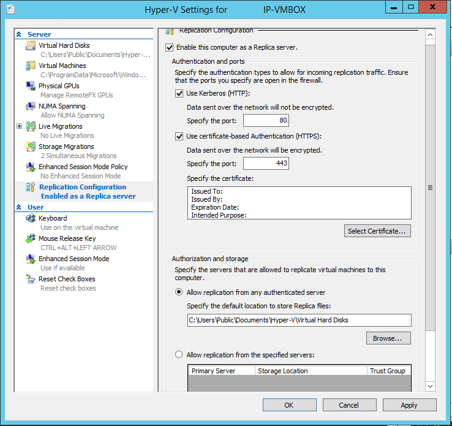
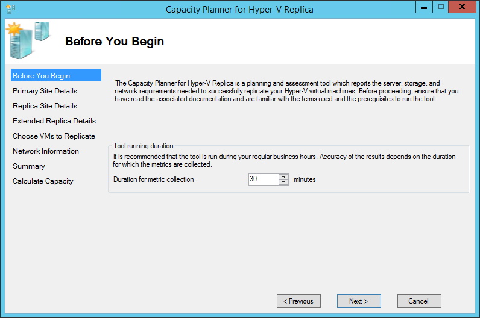
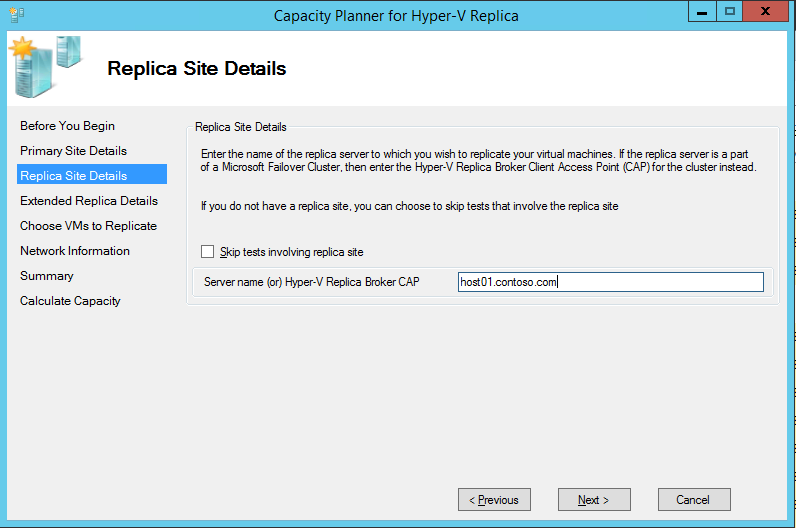

<properties
	pageTitle="Plan capacity for Hyper-V virtual machine replication"
	description="This article contains instructions on how to use the Hyper-V Capacity Planner tool for Azure Site Recovery"
	services="site-recovery"
	documentationCenter="na"
	authors="rayne-wiselman"
	manager="jwhit"
	editor="" />
<tags
	ms.service="site-recovery"
	ms.devlang="na"
	ms.topic="get-started-article"
	ms.tgt_pltfrm="na"
	ms.workload="storage-backup-recovery"
	ms.date="12/01/2015"
	ms.author="raynew" />

# Plan capacity for Hyper-V virtual machine replication

Azure Site Recovery uses Hyper-V Replica to replicate Hyper-V virtual machines from an on-premises site to Azure, or to a secondary datacenter. The Capacity Planner tool for Site Recovery helps you to figure out your replication and bandwidth requirements for Hyper-V virtual machine replication. 

## Before you start

You run the tool on a Hyper-V server or cluster node in your primary site. To run the tool the Hyper-V host servers needs:

- Operating system: Windows Server® 2012 or Windows Server® 2012 R2
- Memory: 20 MB (minimum)
- CPU: 5 percent overhead (minimum)
- Disk space: 5 MB (minimum)

Before you run the tool you'll need to prepare the primary site. If you're replicating between two on-premises sites and you want to check bandwidth, you'll need to prepare a replica server as well.

## Step 1: Prepare the primary site
1. On the primary site make a list of all of the Hyper-V virtual machines you want to replicate and the Hyper-V hosts/clusters on which they're located. The tool can run each time for multiple standalone hosts, or for a single cluster but not both together. It also needs to run separately for each operating system, so you should gather and note your Hyper-V servers as follows: 

  - Windows Server® 2012 standalone servers
  - Windows Server® 2012 clusters
  - Windows Server® 2012 R2 standalone servers
  - Windows Server® 2012 R2 clusters

3. Enable remote access to WMI on all the Hyper-V hosts and clusters. Run this command on each server/cluster to make sure firewall rules and user permissions are set:

        netsh firewall set service RemoteAdmin enable

5. Enable performance monitoring on servers and clusters, as follows:

  - Open the Windows Firewall with the **Advanced Security** snapin, and then enable the following inbound rules: **COM+ Network Access (DCOM-IN)** and all rules in the **Remote Event Log Management group**.

## Step 2: Prepare a replica server (on-premises to on-premises replication)

You don't need to do this if you're replicating to Azure. 

We recommend you set up a single Hyper-V host as a recovery server so that a dummy VM can be replicated to it to check bandwidth.  You can skip this but you won't be able to measure bandwidth unless you do it. 

1. If you want to use a cluster node as the replica configure Hyper-V Replica broker:

	- In **Server Manager**, open **Failover Cluster Manager**.
	- Connect to the cluster, highlight the cluster name and click **Actions** > **Configure Role** to open the High Availability wizard.
	- In **Select Role** click **Hyper-V Replica Broker**. In the wizard provide a **NetBIOS name** and **IP address** to be used as the connection point to the cluster (called a client access point). The **Hyper-V Replica Broker** will be configured, resulting in a client access point name that you should note. 
	- Verify that the Hyper-V Replica Broker role comes online successfully and can fail over between all nodes of the cluster. To do this, right click the role, point to **Move**, and then click **Select Node**. Select a node > **OK**. 
	- If you're using certificate-based authentication, make sure each cluster node and the client access point all have the certificate installed.
2.  Enable a replica server:

	- For a cluster open Failure Cluster Manager, connect to the cluster and click **Roles** > select role > **Replication Setting**s > **Enable this cluster as a Replica server**. Note that if you're using a cluster as the replica you'll need to have the Hyper-V Replica Broker role present on the cluster in the primary site as well.
	- For a standalone server open Hyper-V Manager. In the **Actions** pane, click **Hyper-V Settings** for the server you want to enable, and in **Replication Configuration** click **Enable this computer as a Replica server**.
3. Set up authentication:

	- In **Authentication and ports** select how to authenticate the primary server and the authentication ports. If you're using certificate click **Select Certificate** to select one. Use Kerberos if the primary and recovery Hyper-V hosts are in the same domain, or trusted domains. Use certificates for different domains or a workgroup deployment.
	- In **Authorization and Storage** section, allow **any** authenticated (primary) server to send replication data to this replica server. Click **OK** or **Apply**.

	

	- Run **netsh http show servicestate** to check that the listener is running for the protocol/port you specified:  
4. Set up firewalls. During Hyper-V installation firewall rules are created to allow traffic on the default ports (HTTPS on 443, Kerberos on 80). Enable these rules as follows:
	
		- Certificate authentication on cluster (443): **Get-ClusterNode | ForEach-Object {Invoke-command -computername \$\_.name -scriptblock {Enable-Netfirewallrule -displayname "Hyper-V Replica HTTPS Listener (TCP-In)"}}**
		- Kerberos authentication on cluster (80): **Get-ClusterNode | ForEach-Object {Invoke-command -computername \$\_.name -scriptblock {Enable-Netfirewallrule -displayname "Hyper-V Replica HTTP Listener (TCP-In)"}}**
		- Certificate authentication on standalone server: **Enable-Netfirewallrule -displayname "Hyper-V Replica HTTPS Listener (TCP-In)"**
		- Kerberos authentication on standalone server: **Enable-Netfirewallrule -displayname "Hyper-V Replica HTTP Listener (TCP-In)"**

## Step 3: Run the capacity planner tool

After you've prepared your primary site and set up a recovery server you can run the tool.

1. [Download](https://www.microsoft.com/download/details.aspx?id=39057) the tool from the Microsoft Download Center.
2. Run the tool from one of the primary servers (or one of the nodes from the primary cluster). Right-click the .exe file, and then choose **Run as administrator**.
3. In **Before you begin** specify for how long you want to collect data. We recommend you run the tool during production hours to ensure that data is representative. If you're only trying to validate network connectivity, you can collect for a minute only.

	

4. In  **Primary site details** specify the server name or FQDN for a standalone host, or for a cluster specify the FQDN of the client accept point, cluster name, or any node in the cluster and then click **Next**. The tool automatically detects the name of the server it's running on. The tool picks up VMs that can be monitored for the specified servers.

	

5. In **Replica Site Details** if you're replicating to Azure or if you're replicating to a secondary datacenter and haven't set up a replica server, select **Skip tests involving replica site**. If you are replicating to a secondary datacenter and you've set up a replica type in the FQDN of the standalone server or the client access point for the cluster in **Server name (or) Hyper-V Replica Broker CAP**. 

	

6. In In **Extended Replica Details** enable **Skip the tests involving Extended Replica site**. They aren't supported by Site Recovery.
7. In **Choose VMs to Replicate** the tools connects to the server or cluster and displays VMs and disks running on the primary server, in accordance with the settings you specified on the **Primary Site Details** page. Note that VMs that are already enabled for replication or that aren't running won't be displayed. Select the VMs for which you want to collect metrics. Selecting the VHDs automatically collects data for the VMs too.
9. If you've configured a replica server or cluster, in **Network information** specify the approximate WAN bandwidth you think will be used between the primary and replica sites and select the certificates if you've configured certificate authentication.

	

10. In **Summary** check settings, and click **Next** to begin collecting metrics. Tool progress and status is displayed on the **Calculate Capacity** page. When the tool finishes running click **View Report** to go over the output. By default reports and logs are stored in **%systemdrive%\Users\Public\Documents\Capacity Planner**.

	

## Step 4: Interpret the results
Here are the important metrics. You can ignore metrics which aren't listed here. They're not relevant for Site Recovery.

### On-premises to on-premises replication
  - Impact of replication on the primary host's compute, memory
  - Impact of replication on the primary, recovery hosts's storage disk space, IOPS
  - Total bandwidth required for delta replication (Mbps)
  - Observed network bandwidth between the primary host and the recovery host (Mbps)
  - Suggestion for the ideal number of active parallel transfers between the two hosts/clusters

### On-premises to Azure replication
  - Impact of replication on the primary host's compute, memory
  - Impact of replication on the primary host's storage disk space, IOPS
  - Total bandwidth required for delta replication (Mbps)

## More resources

- For detailed information about the tool read the document that accompanies the tool download.
- Watch a walkthrough of the tool on Keith Mayer’s [TechNet blog](http://blogs.technet.com/b/keithmayer/archive/2014/02/27/guided-hands-on-lab-capacity-planner-for-windows-server-2012-hyper-v-replica.aspx).
- [Get the results](http://blogs.technet.com/b/keithmayer/archive/2014/02/27/guided-hands-on-lab-capacity-planner-for-windows-server-2012-hyper-v-replica.aspx) of our performance testing for on-premises to on-premises Hyper-V replication

## Next steps

- [Set up protection between an on-premises VMM site and Azure](site-recovery-vmm-to-azure.md)
- [Set up protection between an on-premises Hyper-V site and Azure](site-recovery-hyper-v-site-to-azure.md)
- [Set up protection between two on-premises VMM sites](site-recovery-vmm-to-vmm.md)
