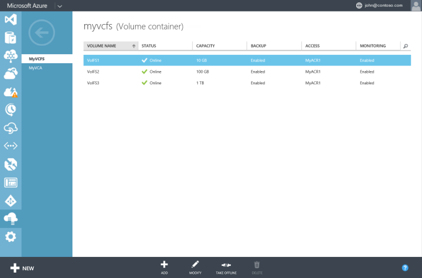
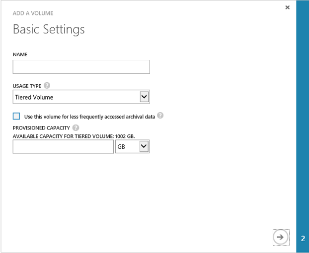
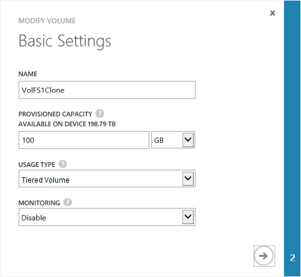

<properties
   pageTitle="Manage your StorSimple volumes | Microsoft Azure"
   description="Explains how to add, modify, monitor, and delete StorSimple volumes, and how to take them offline if necessary."
   services="storsimple"
   documentationCenter="NA"
   authors="SharS"
   manager="carolz"
   editor="" />
<tags 
   ms.service="storsimple"
   ms.devlang="NA"
   ms.topic="article"
   ms.tgt_pltfrm="NA"
   ms.workload="TBD"
   ms.date="01/15/2016"
   ms.author="v-sharos" />

# Use the StorSimple Manager service to manage volumes

[AZURE.INCLUDE [storsimple-version-selector-manage-volumes](../../includes/storsimple-version-selector-manage-volumes.md)]

## Overview

This tutorial explains how to use the StorSimple Manager service to create and manage volumes on the StorSimple device and StorSimple virtual device.

The StorSimple Manager service is an extension of the Azure classic portal that lets you manage your StorSimple solution from a single web interface. In addition to managing volumes, you can use the StorSimple Manager service to create and manage StorSimple services, view and manage devices, view alerts, and view and manage backup policies and the backup catalog.

> [AZURE.NOTE] Azure StorSimple can create thinly provisioned volumes only. You cannot create fully provisioned or partially provisioned volumes on an Azure StorSimple system.
>
> Thin provisioning is a virtualization technology in which available storage appears to exceed physical resources. Instead of reserving sufficient storage in advance, Azure StorSimple uses thin provisioning to allocate just enough space to meet current requirements. The elastic nature of cloud storage facilitates this approach because Azure StorSimple can increase or decrease cloud storage to meet changing demands.

## The Volumes page

The **Volumes** page allows you to manage the storage volumes that are provisioned on the Microsoft Azure StorSimple device for your initiators (servers). It displays the list of volumes on your StorSimple device.

 

A volume consists of a series of attributes:

- **Name** – A descriptive name that must be unique and helps identify the volume. This name is also used in monitoring reports when you filter on a specific volume.

- **Status** – Can be online or offline. If a volume if offline, it is not visible to initiators (servers) that are allowed access to use the volume.

- **Capacity** – Specifies how large the volume is, as perceived by the initiator (server). Capacity specifies the total amount of data that can be stored by the initiator (server). Volumes are thinly provisioned, and data is deduplicated. This implies that your device doesn’t pre-allocate physical storage capacity internally or on the cloud according to configured volume capacity. The volume capacity is allocated and consumed on demand.

- **Access** – Specifies the initiators (servers) that are allowed access to this volume. Initiators that are not members of access control record (ACR) that is associated with the volume will not see the volume.

- **Monitoring** – Specifies whether or not a volume is being monitored. A volume will have monitoring enabled by default when it is created. Monitoring will, however, be disabled for a volume clone. To enable monitoring for a volume, follow the instructions in Monitor a volume.

The most common tasks associated with a volume are:

- Add a volume 
- Modify a volume 
- Delete a volume 
- Take a volume offline 
- Monitor a volume 

## Add a volume

You [created a volume](storsimple-deployment-walkthrough-u1.md#step-6-create-a-volume) during deployment of your StorSimple solution. Adding a volume is a similar procedure.

### To add a volume

1. On the **Devices** page, select the device, double-click it, and then click the **Volume Containers** tab.

2. Select a volume container and click the arrow in the corresponding row to access the volumes associated with the container.

3. Click **Add** at the bottom of the page. The Add a volume wizard starts.

     

4. In the Add a volume wizard, under **Basic Settings**, do the following:

  1. Supply a **Name** for your volume.
  2. Specify the **Provisioned Capacity** for your volume in GB or TB. The capacity must be between 1 GB and 64 TB for a physical device. The maximum capacity that can be provisioned for a volume on a StorSimple virtual device is 30 TB.
  3. From the drop-down list, select the **Usage Type** for your volume. If you are using this volume for archival data, select the **Use this volume for less frequently accessed archival data** check box. For all other use cases, simply select **Tiered Volume**. (Tiered volumes were formerly called primary volumes.)
  5. Click the arrow icon to go to the **Additional Settings** page.

        
   
5. Under **Additional Settings**, add a new access control record (ACR):
  
  1. Select an access control record (ACR) from the drop-down list. Alternatively, you can add a new ACR. ACRs determine which hosts can access your volumes by matching the host IQN with that listed in the record.
  2. We recommend that you enable a default backup by selecting the **Enable a default backup for this volume** check box.
   3. Click the check icon  to create the volume with the specified settings.

Your new volume is now ready to use.

## Modify a volume

Modify a volume when you need to expand it or change the hosts that access the volume.

> [AZURE.IMPORTANT] 
>
> - If you modify the volume size on the device, the volume size needs to be changed on the host as well. 
> - The host-side steps described here are for Windows Server 2012 (2012R2). Procedures for Linux or other host operating systems will be different. Refer to your host operating system instructions when modifying the volume on a host running another operating system. 

### To modify a volume

1. On the **Devices** page, select the device, double-click it, and then click the **Volume Container** tab. This page lists in a tabular format all the volume containers that are associated with the device.

2. Select a volume container and click it to display the list of all the volumes within the container.

3. On the **Volumes** page, select a volume and click **Modify**.

4. In the Modify volume wizard, under **Basic Settings**, you can do the following:

  - Edit the **Name** and **Application Type**.
  - Increase the **Provisioned Capacity**. The **Provisioned Capacity** can only be increased. You cannot shrink a volume after it is created.

    > [AZURE.NOTE] You cannot change the volume container after it is assigned to a volume.

5. Under **Additional Settings**, you can do the following:

  - Modify the ACRs, provided that the volume is offline. If the volume is online, you will need to take it offline first. Refer to the steps in [Take a volume offline](#take-a-volume-offline) prior to modifying the ACR.
  - Modify the list of ACRs after the volume is offline.
 
    > [AZURE.NOTE] You cannot change the **Enable a default backup for this volume** option for the volume.

6. Save your changes by clicking the check icon . The Azure classic portal will display an updating volume message. It will display a success message when the volume has been successfully updated.

7. If you are expanding a volume, complete the following steps on your Windows host computer:

   1. Go to **Computer Management** ->**Disk Management**.
   2. Right-click **Disk Management** and select **Rescan Disks**.
   3. In the list of disks, select the volume that you updated, right-click, and then select **Extend Volume**. The Extend Volume wizard starts. Click **Next**.
   4. Complete the wizard, accepting the default values. After the wizard is finished, the volume should show the increased size.

 **Video available**

To watch a video that demonstrates how to expand a volume, click [here](https://azure.microsoft.com/documentation/videos/expand-a-storsimple-volume/).

## Take a volume offline

You may need to take a volume offline when you are planning to modify it or delete it. When a volume is offline, it is not available for read-write access. You will need to take the volume offline on the host as well as on the device. Perform the following steps to take a volume offline.

### To take a volume offline

1. Make sure that the volume in question is not in use before taking it offline.

2. Take the volume offline on the host first. This eliminates any potential risk of data corruption on the volume. For specific steps, refer to the instructions for your host operating system.

3. After the host is offline, take the volume on the device offline by performing the following steps:

  1. On the **Devices** page, select the device, double-click it, and then click the **Volume Containers** tab. The **Volume Containers** tab lists in a tabular format all the volume containers that are associated with the device.
  2. Select a volume container and click it to display the list of all the volumes within the container.
  3. Select a volume and click **Take offline**.
  4. When prompted for confirmation, click **Yes**. The volume should now be offline.

    After a volume is offline, the **Bring Online** option becomes available.

> [AZURE.NOTE] The **Take Offline** command sends a request to the device to take the volume offline. If hosts are still using the volume, this results in broken connections, but taking the volume offline will not fail. 

## Delete a volume

> [AZURE.IMPORTANT] You can delete a volume only if it is offline.

Complete the following steps to delete a volume.

### To delete a volume

1. On the **Devices** page, select the device, double-click it, and then click the **Volume Containers** tab.

2. Select the volume container that has the volume you want to delete. Click the volume container to access the **Volumes** page.

3. All the volumes associated with this container are displayed in a tabular format. Check the status of the volume you want to delete. If the volume you want to delete is not offline, take it offline first, following the steps in [Take a volume offline](#take-a-volume-offline).

4. After the volume is offline, click **Delete** at the bottom of the page.

5. When prompted for confirmation, click **Yes**. The volume will now be deleted and the **Volumes** page will show the updated list of volumes within the container.

## Monitor a volume

Volume monitoring allows you to collect I/O-related statistics for a volume. Monitoring is enabled by default for the first 32 volumes that you create. Monitoring of additional volumes is disabled by default. Monitoring of cloned volumes is also disabled by default.

Perform the following steps to enable or disable monitoring for a volume.

### To enable or disable volume monitoring

1. On the **Devices** page, select the device, double-click it, and then click the **Volume Containers** tab.

2. Select the volume container in which the volume resides, and then click the volume container to access the **Volumes** page.

3. All the volumes associated with this container are listed in the tabular display. Click and select the volume or volume clone.

4. At the bottom of the page, click **Modify**.

5. In the Modify Volume wizard, under **Basic Settings**, select **Enable** or **Disable** from the **Monitoring** drop-down list.

    

## Next steps

- Learn how to [clone a StorSimple volume](storsimple-clone-volume.md).

- Learn how to [use the StorSimple Manager service to administer your StorSimple device](storsimple-manager-service-administration.md).

 