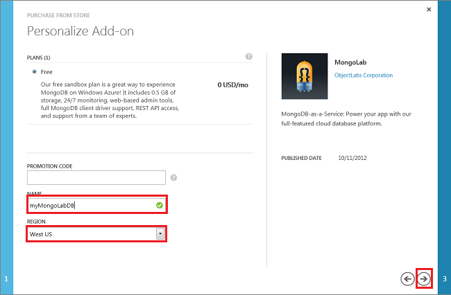
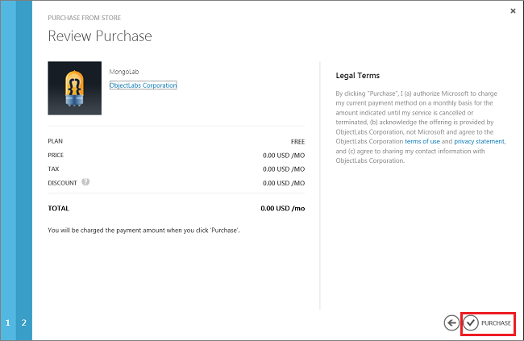
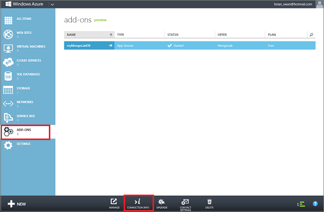

#How to Create a MongoDB Database in Windows Azure

This article will show you how to use [MongoLab] to create a MongoDB database from the [Windows Azure Store]. [MongoLab] is a MongoDB-as-a-service provider that allows you to run and manage MongoDB databases in Windows Azure datacenters and connect to them from any application.  

To create a MongoDB database from the [Windows Azure Store], do the following:

1. Log in to the [Windows Azure Management Portal][portal].
2. Click **+NEW** at the bottom of the page, then select **STORE**.

	

3. Select **MongoLab**, then click the arrow at the bottom of the frame.

	

4. Enter a database name, and select a region, then click the arrow at the bottom of the frame.

	

5. Click the checkmark to complete your purchase.

	

6. After your database has been created, you can manage it from the **ADD-ONS** tab in the management portal.

	

7. You can get the database connection information by clicking on **CONNECTION INFO** at the bottom of the page (shown above).

	 

[MongoLab]: https://mongolab.com/home
[waws]: /en-us/manage/services/web-sites/
[Windows Azure Store]: /en-us/store/overview/
[portal]: http://windows.azure.com/
